# 汇编寄存器

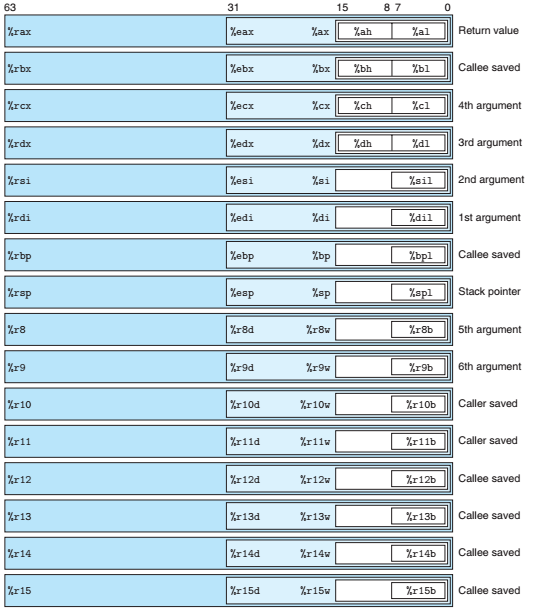

## 8086架构(16bit)

以下寄存器都是16bit位宽

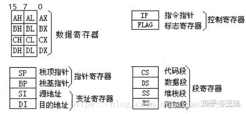

## x86_64架构

### 通用寄存器(32bit)

通用寄存器是程序执行代码最最常用，也最最基础的寄存器，程序执行过程中，绝大部分时间都是在操作这些寄存器来实现指令功能。

- **eax**：通常用来执行加法，函数调用的返回值一般也放在这里面
- **ebx**：数据存取
- **ecx**：通常用作计数器，比如for循环
- **edx**：暂不清楚
- **esp**：**栈顶指针，指向栈的顶部**
- **ebp**：**栈底指针，指向栈的底部，通常用`ebp+偏移量`的形式来定位函数存放在栈中的局部变量**
- **edi**：字符串操作时，用于存放数据源的地址
- **esi**：字符串操作时，用于存放目的地址的，和*edi*两个经常搭配一起使用，执行字符串的复制等操作

### 通用寄存器(64bit)

- **rax**：通常用于存储函数调用返回值
- **rsp**：栈顶指针，指向栈的顶部
- **rdi**：第一个入参
- **rsi**：第二个入参
- **rdx**：第三个入参
- **rcx**：第四个入参
- **r8**：第五个入参
- **r9**：第六个入参
- **rbx**：数据存储，遵循Callee Save原则
- **rbp**：数据存储，遵循Callee Save原则
- **r12~r15**：数据存储，遵循Callee Save原则
- **r10~r11**：数据存储，遵循Caller Save原则

### 状态寄存器(status register, RFLAGS)

RFLAGS也有32位和16位版本，分别是EFLAGS 和FLAGS。但是EFLAGS和FLAGS可以同时使用。

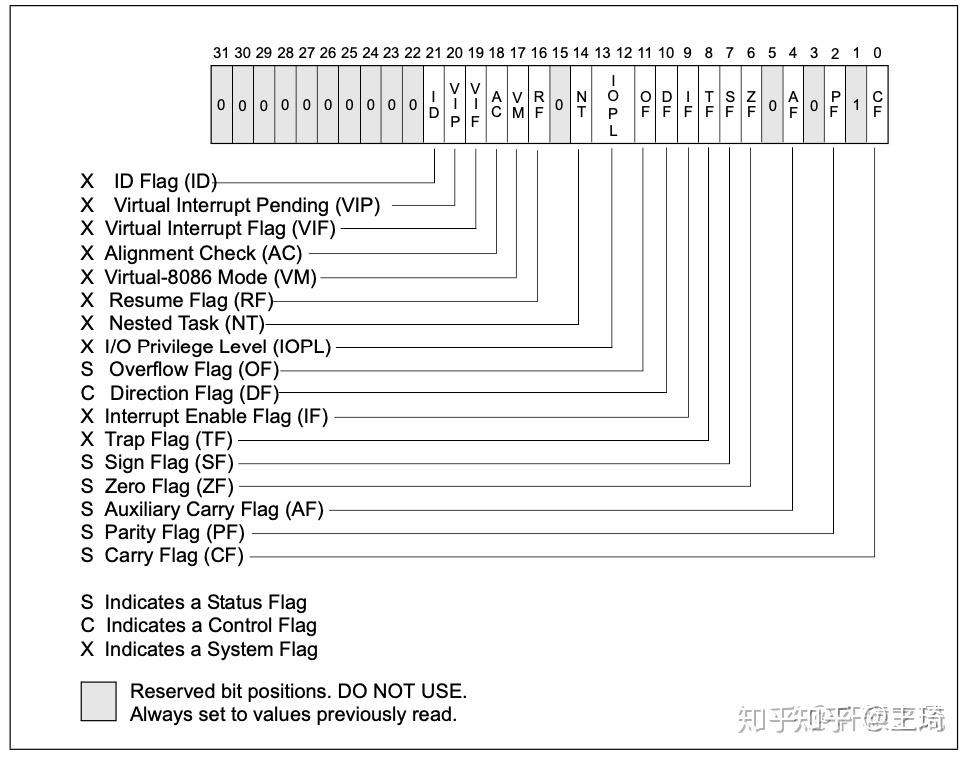

- **CF：**进位标志
- **PF：**奇偶标志
- **ZF：** 零标志
- **SF：** 符号标志
- **OF：** 补码溢出标志
- **TF：** 跟踪标志
- **IF：** 中断标志

### 指针寄存器(instruction pointer, RIP. )

**RIP**寄存器是CPU中最最重要的寄存器了，它指向了下一条要执行的指令所存放的地址，CPU的工作其实就是不断取出它指向的指令，然后执行这条指令，同时指令寄存器继续指向下面一条指令，如此不断重复，这就是CPU工作的基本日常。

### 段寄存器(16bit)

X86-64一共有6个段寄存器: CS, SS, DS, ES, FS, and GS。

- 除了长模式以外的所有CPU运行模式里，都有一个段选择器 selector, 表示当前使用GDT 还是 LDT。 同时，还需要一个段描述符descriptor, 提供了段的基址和范围。（Linux中基本不使用分段）
- 长模式中，除了 FS 和 GS 之外的所有内容都被视为在一个具有零基地址和64位范围的平面地址空间中。 FS 和 GS 作为特殊情况保留，但不再使用段描述符表，取而代之的是，访问保存在 FSBASE 和 GSBASE 中的MSR寄存器中的基地址。


- **cs**：代码段
- **ds**：数据段
- **ss**：栈段
- **es**：扩展段
- **fs**：数据段
- **gs**：数据段

段寄存器里面存储的内容与CPU当前工作的内存寻址模式紧密相关，详细可查阅：

[CPU工作模式：执行程序的三种模式9 赞同 · 0 评论文章!](https://zhuanlan.zhihu.com/p/502776497)


段寄存器通过**Index**查找**GDT表**找到段所在的线性地址，进而开展后续工作。

### 控制寄存器(32bit)

 x86-64 定义了一组控制寄存器，可用于管理和检查 CPU 的状态。有 16 个“主”控制寄存器，所有这些都可以通过[MOV variant](https://link.zhihu.com/?target=https%3A//www.felixcloutier.com/x86/mov-1)变体访问: 

| Name | Purpose                        |
| ---- | ------------------------------ |
| CR0  | Basic CPU operation flags      |
| CR1  | Reserved                       |
| CR2  | Page-fault linear address      |
| CR3  | Virtual addressing state       |
| CR4  | Protected mode operation flags |
| CR5  | Reserved                       |
| CR6  | Reserved                       |
| CR7  | Reserved                       |
| CR8  | Task priority register (TPR)   |
| CR9  | Reserved                       |
| CR10 | Reserved                       |
| CR11 | Reserved                       |
| CR12 | Reserved                       |
| CR13 | Reserved                       |
| CR14 | Reserved                       |
| CR15 | Reserved                       |

控制寄存器记录cpu运行过程中自身的一些关键信息，包括cr0~cr4寄存器。

#### CR0寄存器

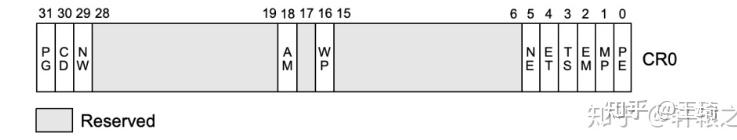

- **PG**：开启分页模式
- **CD**：控制**Cache**高速缓存功能，CD=1关闭该功能
- **NW**：控制使用通写还是回写，用于维护内存数据一致性，NW=1关闭该功能，数据一致性即通过**MESI协议**
- **AM**：控制启用内存对齐自动检查
- **WP**：控制开启内存写保护，WP=0开启写保护，对只读页面尝试写入将触发异常，这一机制常常被用来实现**写时复制**功能
- **PE**：如果PE=1，则保护模式启动，如果PE=0，则在实模式下运行

```text
mov eax, cr0
;开启 保护模式和分页模式
bts eax, 0    ;CR0.PE =1
bts eax, 31   ;CR0.PG = 1
;开启 CACHE 
btr eax, 29   ;CR0.NW=0
btr eax, 30   ;CR0.CD=0
mov cr0, eax 
```

------

#### CR1寄存器

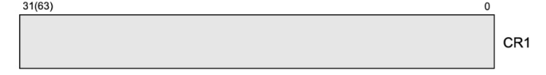

- CR1寄存器暂且保留未使用

------

#### CR2寄存器

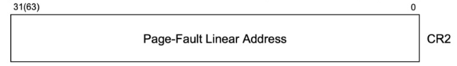

- x86架构中的CR2寄存器是页故障线性地址寄存器，也称为页故障地址寄存器（Page Fault Linear Address Register）。当CPU检测到一个页故障（Page Fault）时，它会将故障发生时的线性地址存储在CR2寄存器中，这个地址指向导致页故障的页面。
- 内核可以通过读取CR2寄存器来获取引起页故障的地址，然后对该地址所在的页面进行处理，比如进行页面的分配或者进行页面的交换。CR2寄存器的值可以在中断或异常处理例程中读取。
- 在保护模式下，访问CR2寄存器需要使用特殊的指令，比如MOV CR2, EAX将EAX寄存器的值写入CR2寄存器，或MOV EAX, CR2将CR2寄存器的值读取到EAX寄存器中。在x86_64架构下，CR2寄存器的大小为64位。

------

#### CR3寄存器

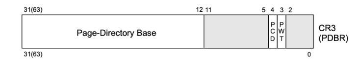

- CR3寄存器和**MMU**密切相关，保存了当前进程所使用的虚拟地址空间的**页目录地址**，可以说是整个虚拟地址翻译中的顶级指挥棒，**在进程空间切换的时候，CR3也将同步切换**。
- CR3寄存器的高20位用于保存**页目录地址**，0-11位记录标记位，所以**页目录地址**必须是4KB的整数倍。


```c-objdump
mov eax, PAGE_TLB_BADR;页表物理地址
mov cr3, eax
```

------

#### CR4寄存器

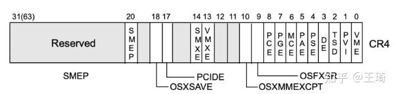

- **PAE**：PAE = 1，使分页产生超过32位的物理地址，当清除时，限制物理地址为32位。**在进入IA-32e模式（长模式）之前必须设置PAE.**

CR4寄存器用于控制CPU的特性和操作系统的行为。它的作用如下：

1. 控制分页机制：x86CR4寄存器的最重要作用是控制分页机制。在64位x86处理器中，x86CR4寄存器的第5位（PAE）控制是否启用物理地址扩展（Physical Address Extension，PAE）模式，第7位（PSE）控制是否启用页大小扩展（Page Size Extension，PSE）模式，第12位（PCIDE）控制是否启用页表缓存（Page Directory Cache，PDC）
2. 启用SMEP和SMAP保护机制：x86CR4寄存器的第20和第21位控制启用Supervisor Mode Execution Protection（SMEP）和Supervisor Mode Access Prevention（SMAP）保护机制
3. 启用虚拟化扩展：x86CR4寄存器的第13位控制是否启用虚拟化扩展（Virtualization Extension，VME）
4. 其他：x86CR4寄存器还控制着其他一些特性，如Debugging Extensions（DE）、Machine Check Exception（MCE）和Page Attribute Table（PAT）等

在Linux内核中，x86CR4寄存器的主要作用是控制分页机制和启用SMEP和SMAP保护机制。

```text
;长模式下，开始分页保护
mov eax, cr4
bts eax, 5   ;CR4.PAE = 1
mov cr4, eax ;开启 PAE
mov eax, PAGE_TLB_BADR ;物理页地址
mov cr3, eax
```

------

### 描述符寄存器(System table pointer registers)

 这就是英特尔SDM对这些寄存器的称呼。这些寄存器保存着各种保护模式表的大小和指针。 

- GDTR：存放GDT的大小和基址
- LDTR：保存LDT的大小和基址
- IDTR：保存IDT的大小和基址
- TR：保存TSS的选择器和TSS的基址

GDTR、LDTR和IDTR在64位模式下都是80位：16个低位是寄存器的表的大小，高64位是表的其实地址。

TR同样也是80位。16位用于选择器（其行为与段选择器相同），然后另外64位用于TSS的基本地址。

#### GDTR(48bit)


全局描述符表寄存器，CPU现在使用的是段+分页结合的内存管理方式，那系统总共有那些分段呢？这就存储在一个叫全局描述符表（**GDT**）的表格中，并用**GDTR**寄存器指向这个表。这个表中的每一项都描述了一个内存段的信息

#### LDTR(16bit)

局部描述符表寄存器，这个寄存器和上面的**GDTR**一样，同样指向的是一个段描述符表（**LDT**）。不同的是，**GDT**是全局唯一，**LDT**是局部使用的，可以创建多个，随着任务段切换而切换（下文介绍任务寄存器会提到）

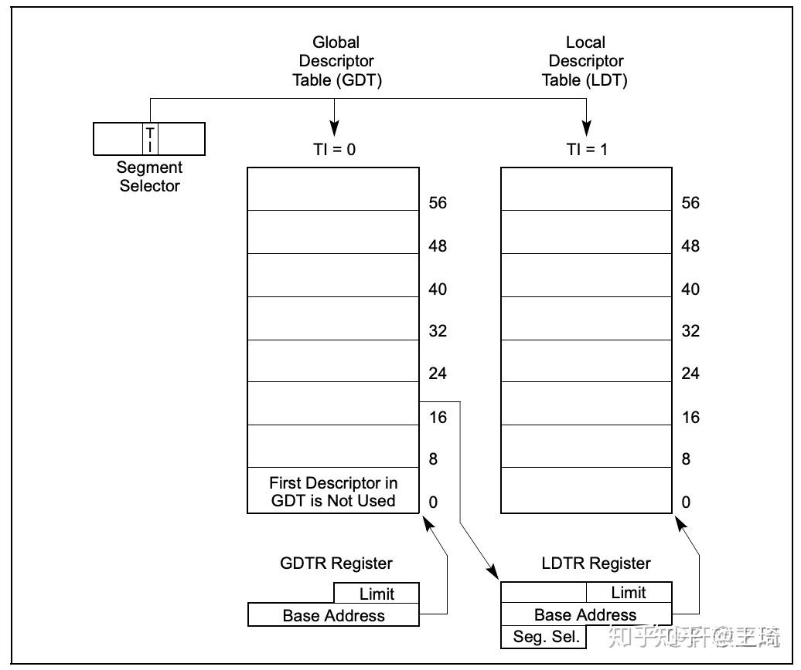

**GDT**和**LDT**中的表项，就是段描述符，一个表项占据8个字节，里面存储了一个内存分段的诸多信息：基地址、大小、权限、类型等信息。其结构如下：

① 32位段基址

② 20位段界限，即段长，粒度由G位控制

③ 粒度位G位：

当G = 0时，段长以字节为单位，则最大段长为2^20B = 1MB

当G = 1时，段长以页（4KB）为单位，则最大段长为2^20 * 4KB = 4GB

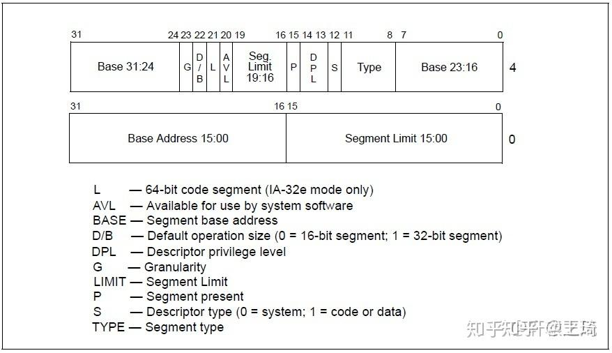

**IDT**中的表项称为**Gate**，中文意思为**门**，因为这是应用程序进入内核的主要入口，表中存储的不全是中断描述符，**IDT**中的表项存在三种类型，存储了处理这个中断/异常/任务时该去哪里处理的地址，对应三种类型的门：

- **任务门**
- **陷阱门**
- **中断门**

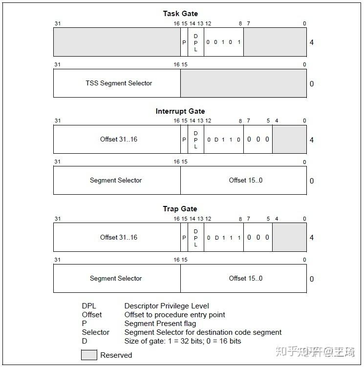

idt表项结构

#### IDTR(48bit)

中断描述符表寄存器，指向了**中断描述符表IDT**，这个表的每一项都是一个中断处理描述符，当CPU执行过程中发生了硬中断、异常、软中断时，将自动从这个表中定位对应的表项，里面记录了发生中断、异常时该去哪里执行处理函数。

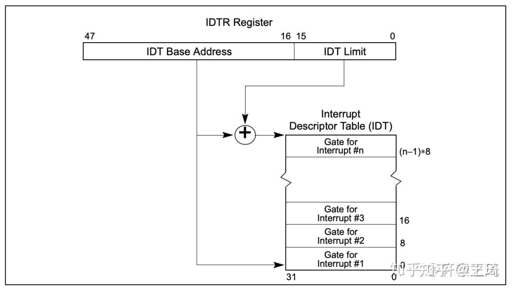

### 任务寄存器(16bit)

- **TR**：指向当前运行的任务

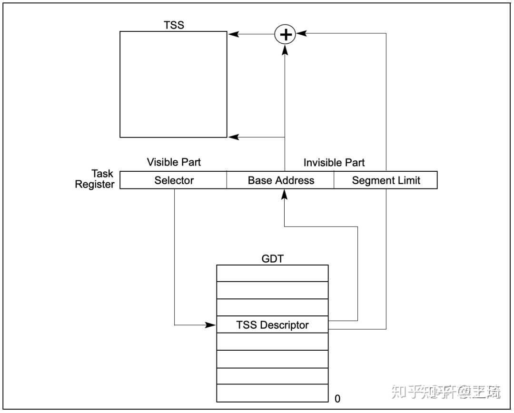

- 定义了描述任务的数据结构**TSS（任务状态段）**，里面存储了一个任务的上下文（一系列寄存器的值），下图是一个32位CPU的TSS结构图：

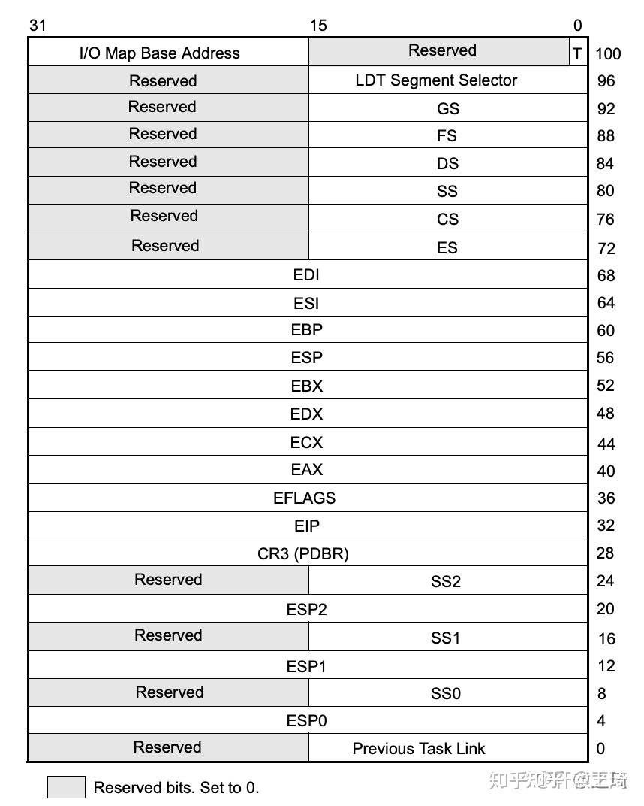

> x86CPU的构想是每一个任务对应一个TSS，然后由TR寄存器指向当前的任务，执行任务切换时，修改TR寄存器的指向即可，这是硬件层面的多任务切换机制。
> 这个构想其实还是很不错的，然而现实却打了脸，包括Linux和Windows在内的主流操作系统都没有使用这个机制来进行线程切换，而是自己使用软件来实现多线程切换。
> 所以，绝大多数情况下，TR寄存器都是指向固定的，即便线程切换了，TR寄存器仍然不会变化。
> 注意，我这里说的的是绝大多数情况，而没有说死。虽然操作系统不依靠TSS来实现多任务切换，但这并不意味着CPU提供的TSS操作系统一点也没有使用。还是存在一些特殊情况，如一些异常处理会使用到TSS来执行处理。

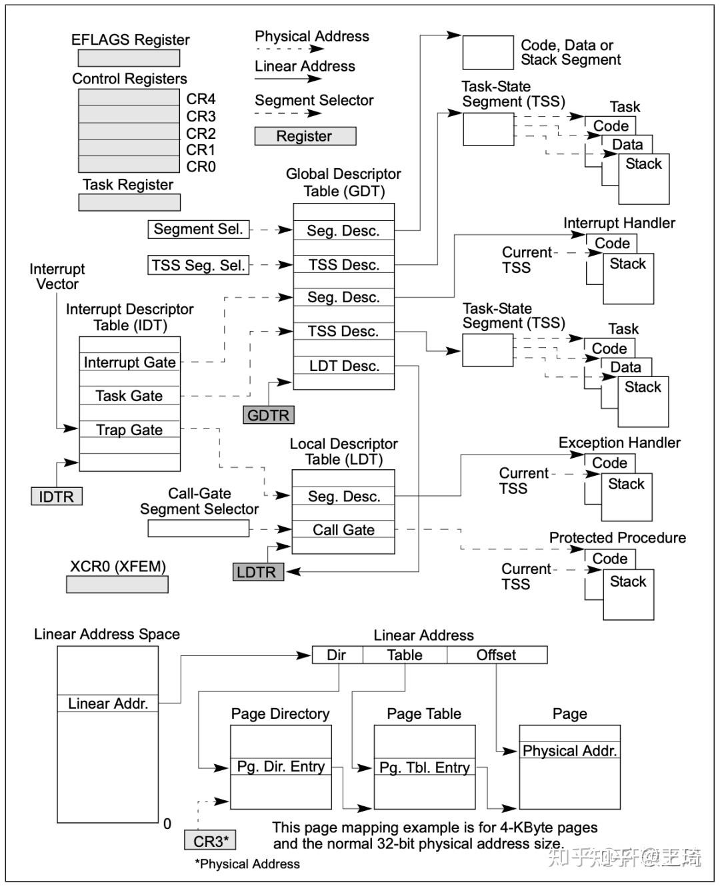

### 模型特定寄存器MSR（Model Specific Register）

MSR（Model Specific Register）是x86架构中的概念，指的是在x86架构处理器中，一系列用于控制CPU运行、功能开关、调试、跟踪程序执行、监测CPU性能等方面的寄存器。

到Intel Pentium处理器的时候，Intel正式引入RDMSR和WRMSR两个指令用于读和写MSR寄存器，这个时候MSR就算被正式引入。在引入RDMSR和WRMSR指令的同时，也引入了CPUID指令，该指令用于指明具体的CPU芯片中，哪些功能是可用的，或者这些功能对应的MSR寄存器是否存在，软件可以通过CPUID指令查询某些功能是否在当前CPU上是否支持。

每个MSR寄存器都会有一个相应的ID，即MSR Index，或者也叫作MSR寄存器地址，当执行RDMSR或者WRMSR指令的时候，只要提供MSR Index就能让CPU知道目标MSR寄存器。这些MSR寄存器的编号（MSR Index）、名字及其各个数据区域的定义可以在Intel x86架构手册”Intel 64 and IA-32 Architectures Software Developer’s Manual”的[Volume 4](https://link.zhihu.com/?target=https%3A//software.intel.com/sites/default/files/managed/22/0d/335592-sdm-vol-4.pdf)中找到。

- **IA32_SYSENTER_CS**
- **IA32_SYSENTER_ESP**
- **IA32_SYSENTER_EIP**

这三个**MSR**寄存器是用来实现**快速系统调用**。

在早期的x86架构CPU上，系统调用依赖于软中断实现，类似于前面调试用到的int 3指令，在Windows上，系统调用用到的是**int 2e**，在Linux上，用的是**int 80**。

软中断毕竟还是比较慢的，因为执行软中断就需要内存查表，通过IDTR定位到IDT，再取出函数进行执行。

系统调用是一个频繁触发的动作，如此这般势必对性能有所影响。在进入奔腾时代后，就加上了上面的三个MSR寄存器，**分别存储了执行系统调用后，内核系统调用入口函数所需要的段寄存器、堆栈栈顶、函数地址，不再需要内存查表**。快速系统调用还提供了专门的CPU指令**sysenter/sysexit**用来发起系统调用和退出系统调用。

在64位上，这一对指令升级为**syscall/sysret**。

> https://www.owalle.com/2021/12/26/all-registers-x86-64/