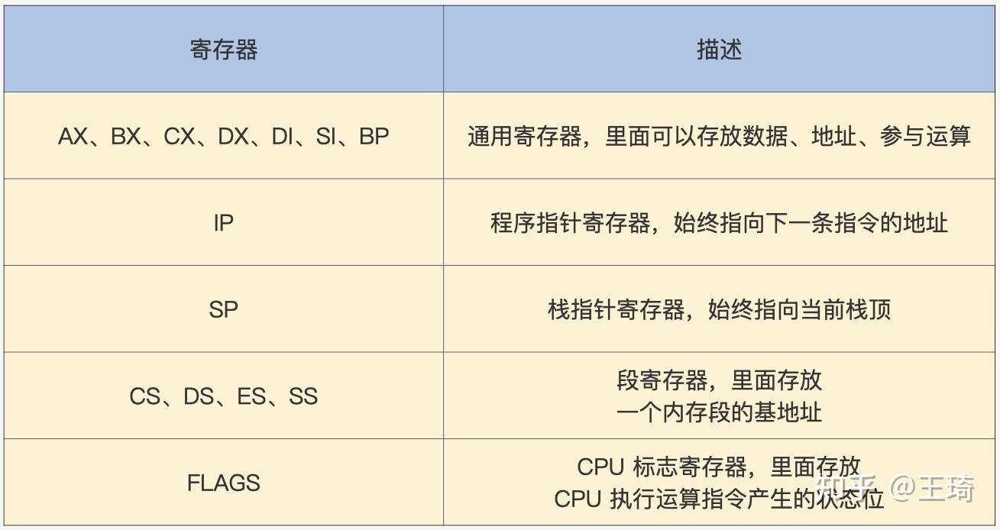

# CPU工作模式：执行程序的三种模式

[TOC]

## 实模式（8086架构）

实地址模式，包括两个方面：

- **指令集**：下发真实的指令动作，对指令集不做特权等级检查
- **地址**：下发真实的物理地址，没有**MMU**虚实地址映射

### 寄存器

实模式下的寄存器均为16bit寄存器，应该是8086架构下的寄存器：



实模式寄存器

### 内存访问

访问内存需要通过地址值，而地址值则是通过寄存器实现的，取指通过**CS:IP**寄存器组实现，取数据通过包括**SS:SP**等寄存器组实现，**这些寄存器保存的都是真实的物理地址**。


实模式内存访问

```c-objdump
data SEGMENT ;定义一个数据段存放Hello World!
    hello  DB 'Hello World!$' ;注意要以$结束
data ENDS
code SEGMENT ;定义一个代码段存放程序指令
    ASSUME CS:CODE,DS:DATA ;告诉汇编程序，DS指向数据段，CS指向代码段
start:
    MOV AX,data  ;将data段首地址赋值给AX                
    MOV DS,AX    ;将AX赋值给DS，使DS指向data段
    LEA DX,hello ;使DX指向hello首地址
    MOV AH,09h   ;给AH设置参数09H，AH是AX高8位，AL是AX低8位，其它类似
    INT 21h      ;执行DOS中断输出DS指向的DX指向的字符串hello
    MOV AX,4C00h ;给AX设置参数4C00h
    INT 21h      ;调用4C00h号功能，结束程序
code ENDS
END start
```

### 中断

通过先保存**CS:IP**寄存器组，并加载新的**CS:IP**寄存器，从而获取新的指令并执行，中断包括硬中断、软中断

- **硬中断**：中断控制器给 CPU 发送了一个电子信号，CPU 会对这个信号作出应答，随后中断控制器会将中断号发送给 CPU。
- **软中断**：即**INT**指令，通过跟随一个软中断号。

为了实现中断，需要在内存中实现一个**中断向量表IDT**，这个表的地址和长度由 寄存器 **IDTR** 指向。实模式下，表中的一个条目由代码段地址和段内偏移组成，如下图所示。


实模式中断向量表

CPU结合**IDTR**寄存器及中断号获取中断向量条目，进而获取**CS:IP**寄存器，处理中断。

## 保护模式（X86架构）

保护模式出现的主要原因是为了解决实模式的两个问题

1. CPU 对任何指令不加区分地执行
2. CPU 对访问内存的地址不加限制

### 寄存器

保护模式增加了部分寄存器位宽，同时新增了一些寄存器


保护模式寄存器

### 特权级

基于实模式下CPU 对任何指令不加区分地执行，增加了特权级，不仅对指令权限作了限制，对资源的访问权限也作了限制，特权级包括***r0~r3\***共4个等级，权限依次降低。


CPU特权级

- **指令权限**：每个特权级执行指令的数量不同，R0 可以执行所有指令，R1、R2、R3 依次递减，它们只能执行上一级指令数量的子集。
- **内存访问权限**：通过段描述符配合特权级等实现地址的安全访问。

### 内存访问

分段模型下，保护模式保护的内存访问转换为对段的保护，16bit位宽的段寄存器无法保存32bit的段地址、段内偏移，所以通过64bit位宽的段描述符描述一个段信息，其格式如下：


保护模式段描述符

其中段基址占32bit，段长度占20bit，同时包括众多标志位，其中**DPL**便可用于特权等级保护

多个段描述形成全局段表**GDT**，该表由全局段表寄存器**GDTR**指示，其格式如下:


全局段表GDT

段寄存器中不再保存真实物理地址，而是段描述符索，在访问内存时，通过GDTR结合段索引找到段描述符。

### 段选择子

段寄存器存放的是由**影子寄存器**、**段描述符索引**、**描述符表索引**、**权限级别**组成，其结构如下：


保护模式段选择子

段描述符是8字节对齐，因此可以通过低三位存放**TI**、**RPL**标志位。在寻址时，结合**全局段表GDT**找到段描述符，进而访问内存。其中**RPL**就是当前特权等级，若 ���≤��� ，则有权访问目标段。

### 中断

实模式下通过中断向量表加载**CS:IP**寄存器组获取指令处理中断，但是没有做权限检查。保护模式下，通过中断描述符扩展中断信息，其格式如下：


保护模式中断描述符

同样的，保护模式要实现中断，也必须在内存中有一个中断向量表，该表由 **IDTR** 寄存器指向，只不过中断向量表中的条目变成了中断门描述符，如下图所示：


中断向量表IDT

设置：

 **DPL(idt)**：中断描述符的**DPL**特权等级

**DPL(gdt)**：中断描述符所指向的段描述符的**DPL**特权等级

**DPL(cur)**：当前寄存器的DPl特权等级，此处即为**CS**、**IP**寄存器的**RPL**特权等级

此时的中断处理流程如下：


中断处理

1. 检查中断号的有效性，x86 CPU 最大支持 256 个中断源（即中断号：0~255），然后检查描述符类型（是否是中断门或者陷阱门）、是否为系统描述符，是不是存在于内存中。
2. 获取中断描述符后，根据其中的**段选择子(16bit)**、**段偏移量(32bit)**获取段描述符。
3. 特权等级检查，若 DPL(cur) ≤ DPL(idt) 且 DPL(cur) ≥ DPL(gdt)，则 DPL(cur) ≡ DPL(gdt)，即提升CPU的特权等级。
4. 在提升CPU特权等级的同时，可能还伴随栈的切换，提升前若 DPL(cur) ≡ DPL(gdt)，则为同级权限不做栈切换，否则在栈切换同时，还需要从**TSS寄存器**中加载具体权限的**SS**、**ESP**等寄存器，当然，也会检查这些寄存器所指向的段描述符。
5. 检查通过后，将中断寄存器中的段选择子加载到**CS寄存器**，将段偏移加载到**EIP寄存器**。

### 平坦模型

所谓平坦模型，就是是分段成为一种“虚设”，表现为所有段都从同一个地址开始，因此，基于32bit的寄存器，最大地址空间为4G，把**所有段的基地址设为 0，段的长度设为 0xFFFFF，段长度的粒度设为 4KB**，这样所有的段都指向同一个（2^20*4KB=4GB）字节大小的地址空间，这就是平坦模型，***在这种情况下，CS:IP寄存器组指向的地址实际为IP寄存器指向的地址**。

**根本原因是为了向下兼容不支持分段机制的体系架构，因此在平坦模式下：**

**段基址+段偏移=线性地址 =》 0+段偏移=线性地址 =》偏移地址=线性地址**

**这样就直接实现了虚拟地址到线性地址的映射，寄存器中的虚拟地址和最终的线性地址就是同一地址。**

**tag：**段基址+段偏移 = 线性地址

线性地址 + MMU分页机制 = 物理地址

```text
GDT_START:
knull_dsc: dq 0
;第一个段描述符CPU硬件规定必须为0
kcode_dsc: dq 0x00cf9e000000ffff
;段基地址=0，段长度=0xfffff
;G=1,D/B=1,L=0,AVL=0 
;P=1,DPL=0,S=1
;T=1,C=1,R=1,A=0
kdata_dsc: dq 0x00cf92000000ffff
;段基地址=0，段长度=0xfffff
;G=1,D/B=1,L=0,AVL=0 
;P=1,DPL=0,S=1
;T=0,C=0,R=1,A=0
GDT_END:

GDT_PTR:
GDTLEN  dw GDT_END-GDT_START-1
GDTBASE  dd GDT_START
```

### 开启保护模式

x86 CPU 在第一次加电和每次 reset 后，都会自动进入实模式，要想进入保护模式，就需要程序员写代码实现从实模式切换到保护模式，步骤如下：

- 准备全局段表**GDT**

```text
GDT_START:                       ;定义全局段表GDT
knull_dsc: dq 0                  ;第一个段描述符CPU硬件规定必须为0，索引为0
kcode_dsc: dq 0x00cf9e000000ffff ;代码段描述符，索引为1
kdata_dsc: dq 0x00cf92000000ffff ;数据段描述符，索引为2
GDT_END:
GDT_PTR:                         ;定义GDTR寄存器
GDTLEN  dw GDT_END-GDT_START-1   ;GDT长度
GDTBASE  dd GDT_START            ;GDT基地址
```

- 加载设置 GDTR 寄存器，使之指向全局段描述符表

```text
lgdt [GDT_PTR]
```

- 设置[CR0寄存器](https://zhuanlan.zhihu.com/p/502718676) ，开启保护模式

```text
;开启 PE
mov eax, cr0
bts eax, 0                      ; CR0.PE =1
mov cr0, eax         
```

- 进行长跳转，加载 CS 段寄存器，即段选择子

```text
jmp dword 0x8 :_32bits_mode ;_32bits_mode为32位代码标号即段偏移
```

初始上电时，设备处于实模式，当CPU检查**CR0.PE =1**，说明进入了保护模式，此时根据**GDTR寄存器**找到**全局段表GDT**，通过汇编`jmp xxx:xxx`更新**CS:IP**，即**CS=0x8，EIP=_32bits_mode**，按照段寄存器结构，获取段索引为1的代码段，更新CS的影子寄存器。

## 长模式（X86_64架构）

长模式又名 AMD64，因为这个标准是 AMD 公司最早定义的，它使 CPU 在现有的基础上有了 64 位的处理能力，既能完成 64 位的数据运算，也能寻址 64 位的地址空间。

### 寄存器

长模式相比于保护模式，增加了一些通用寄存器，并扩展通用寄存器的位宽，所有的通用寄存器都是 64 位，还可以单独使用低 32 位。


长模式寄存器

### 段描述符

长模式依然具备保护模式绝大多数特性，如特权级和权限检查，但是**弱化段模式管理，CPU 不再对段基址和段长度进行检查，只对 DPL 进行相关的检查，而地址的检查则交给了 MMU**，其格式如下：


长模式段描述符

长模式下的段描述符表汇编如下：

```text
ex64_GDT:
null_dsc:  dq 0
;第一个段描述符CPU硬件规定必须为0
c64_dsc:dq 0x0020980000000000  ;64位代码段
;段长度和段基址无效位填0
;D/B=0,L=1,AVL=0 
;P=1,DPL=0,S=1
;T=1,C=0,R=0,A=0
d64_dsc:dq 0x0000920000000000  ;64位数据段
;段长度和段基址无效位填0
;P=1,DPL=0,S=1
;T=0,C/E=0,R/W=1,A=0
eGdtLen   equ $ - null_dsc  ;GDT长度
eGdtPtr:dw eGdtLen - 1  ;GDT界限
     dq ex64_GDT ;GDT基地址
```

### 中断

长模式下同样通过**中断描述符**组成的**中断向量表IDT**实现中断处理，但长模式的中断描述符表项扩充到16字节，其中段偏移量扩充到8个字节，其结构如下：


长模式中断描述符

### 开启长模式

我们既可以从实模式直接切换到长模式，也可以从保护模式切换长模式，步骤如下：

- 准备长模式全局段描述符表

```text
ex64_GDT:
null_dsc:  	dq 	0
;第一个段描述符CPU硬件规定必须为0
c64_dsc:	dq 	0x0020980000000000		;64位代码段
d64_dsc:	dq 	0x0000920000000000		;64位数据段
eGdtLen   	equ $ - null_dsc			;GDT长度
eGdtPtr:	dw 	eGdtLen - 1				;GDT界限
     		dq ex64_GDT					;GDT基地址
```

- **切换到长模式必须要开启分页，分页模式需要MMU页表进行地址转换，MMU页表地址由**[CR3寄存器](https://zhuanlan.zhihu.com/p/502718676)**指向，同时，在进入长模式（IA-32e模式）之前必须设置PAE，由**[CR4寄存器](https://zhuanlan.zhihu.com/p/502718676)**控制**

```text
mov eax, cr4
bts eax, 5   			;CR4.PAE = 1
mov cr4, eax 			;开启 PAE
mov eax, PAGE_TLB_BADR 	;页表物理地址
mov cr3, eax
```

- 加载 GDTR 寄存器，使之指向全局段描述表

```text
lgdt [eGdtPtr]
```

- **开启长模式，要同时开启保护模式和分页模式，在实现长模式时定义了** [MSR 寄存器](https://zhuanlan.zhihu.com/p/502718676)**，需要用专用的指令 rdmsr、wrmsr 进行读写，IA32_EFER 寄存器的地址为 0xC0000080，它的第 8 位决定了是否开启长模式**

```text
;开启 64位长模式
mov ecx, IA32_EFER
rdmsr
bts eax, 8  ;IA32_EFER.LME =1
wrmsr
;开启 保护模式和分页模式
mov eax, cr0
bts eax, 0    ;CR0.PE =1
bts eax, 31   ;CR0.PG = 1
mov cr0, eax
```

- 进行跳转，加载 CS 段寄存器，刷新其影子寄存器

```text
jmp 08:entry64 ;entry64为程序标号即64位偏移地址
```

通过汇编`jmp xxx:xxx`更新**CS:IP**，即**CS=0x8，RIP=entry64**，按照段寄存器结构，获取段索引为1的代码段，更新CS的影子寄存器。

> 应用自：https://zhuanlan.zhihu.com/p/502776497