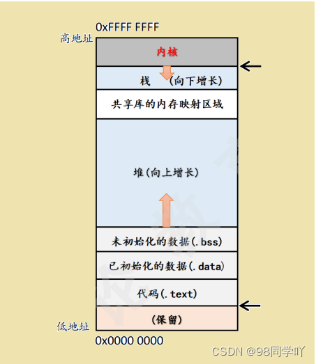

# new的使用

## 1、地址空间
可执行程序（进程）的虚拟地址空间：



内核：操作系统
栈区：函数的形参，非静态的局部变量，函数现场保护数据等，栈是向下增长的
共享库的内存映射区域：用于装载一个共享的动态内存库。用户可以使用系统接口创建共享内存，做进程间的通信
堆区：用于程序运行时动态内存的分配，堆是可以上增长的
数据段：存储全局数据和静态数据，分为 .bss 和 .data
代码段：可执行程序（机器指令）和常量数据

## 2、new
new 负责在 堆区heap 中找到一个足以满足要求的内存。new还有另外一种变体，被称为 定位new 运算符，能够指定使用具体的内存位置。可以用这个特性来设置其内存管理章程，处理需要通过特定地址进行访问的硬件或在特定位置创建对象

### 2.1 new的基本用法

```cpp
int *a = new[5];
class A { ... };  // 声明一个类 A
A *obj = new A();  // 使用 new 创建对象
delete []a;  // new 和 delete 必须对应使用，new 创建一组对象，那么 delete 就要释放一组对象
delete obj;
```

【分析】
这里我们需要注意，new int[5] 仅仅分配了空间，但是 new A()，不仅仅为对象 obj 在堆上分配了空间，而且还调用了 A的构造函数，生成了这个对象

**所以 new A() 这样方式的功能如下：**

- 在堆上分配空间
- 在分配空间上调用对象的构造函数（这也是 new 和 malloc 的主要区别，是否调用构造函数）

**同理，在调用 delete obj 的时候**

- 首先调用 这个对象 的析构函数
- 然后释放这个对象的空间

### 2.2 new的升级版本
从上面可以看到，new的功能是：1. 分配空间； 2. 调用构造函数

其实C++规定new的这两个功能分开来实现：

1. 分配空间：调用函数 `operate new` 来实现
2. 调用构造函数：调用 `placement new` 来实现

现在有三个 new 了，第一个 new 就是我们常说的 new，这个 new 调用接下来的两个 new 来实现它的功能。（我们称这个 new 为：new operator，叫做 “new 表达式”，因为operator 在 new 后面，所以叫做：new表达式，也就是关键字）

new 关键字会调用 operator new 来分配空间：这里 operator new 是一个全局的函数，写在一个文件中 。当使用 new 关键字的时候，编译器会自动找到这个函数，并且调用这个函数，这个函数的声明如下:

```cpp
// 全局 operator new
void* operator new(std::size_t size) throw(std::bad_alloc)  {
	if(size == 0)
		size =1;
	void* p;
	while((p = ::malloc(size)) == 0)  {  // 采用 malloc 分配空间
		std::new_handler nh = std::get_new_handler();
		if(nh)
			nh();
		else
			throw std::bad_alloc();
	}
	return p;
}
// 对应的全局 operator delete 采用 free 释放空间
void operator delete(void* ptr)  {
	if (ptr)
		::free(ptr);  // 采用 free 释放空间
}
```

这个 `operator new` 函数称为 全局 operator new。（这里称为 全局 主要是因为：每个类还可以重载自己的 operator new() 函数）

这个 operator new 函数称为 全局 operator new。（这里称为 全局 主要是因为：每个类还可以重载自己的 operator new() 函数）

### 2.3 内存管理的基本要求

如果只考虑分配和释放，内存管理基本要求是 “不重不漏” ：既不重复 delete，也不漏掉 delete。也就是我们常说的 new/delete 要配对，“配对” 不仅是个数相等，还隐含了 new 和 delete 的调用本身要匹配，不要“东家借的西家还”。例如：

- 用系统默认的 malloc() 分配的内存要交给系统默认的 free() 去释放；
- 用系统默认的 new 表达式创建的对象要交给系统默认的 delete 表达式去析构并释放；
- 用系统默认的 new[] 表达式创建的对象要交给系统默认的 delete[] 表达式去析构并释放；
- 用系统默认的 ::operator new() 分配的内存要交给系统默认的 ::operator delete() 去释放；
- 用 placement new 创建的对象要用 placement delete 去析构（其实就是直接调用析构函数）；
- 从某个内存池 A 分配的内存要还给这个内存池；

## 3、对于内置类型 new/delete/malloc/free 可以混用
区别

- new/delete 是C++中的运算符。malloc/free 是函数
- malloc 申请内存空间时，手动计算所需大小，new 只需要类型名，自动计算大小
- malloc 申请的内存空间不会初始化，new 可以初始化（需要调用构造函数）
- malloc 的返回值为 void\*，接受时必须强转，new不需要
- malloc 申请内存空间失败时，返回的是NULL，使用时必须判空；new申请内存空间失败时会抛出异常（可以加上 nothrow），所以要有捕获异常处理程序

## 4、C和C++的动态内存管理

### 4.1 C的动态内存管理

```
int main()
{
	int n = 10;
	int* ipa = (int*)malloc(sizeof(int)*n);
	int* ipb = (int*)calloc(n, sizeof(int));
	ipa = (int*)realloc(ipa, sizeof(int)*n*2);
	//
	// 
	free(ipa);  ipa = NULL;  // 释放之后一定要将指针置为NULL，防止出现 失效指针
	free(ipb);  ipb = NULL;
	return 0;
}
```

### 4.2 C++的动态内存管理

1、new 运算符的使用

```
int main()
{
	int n = 10;
	int* ipa = new int(10);
}
```

