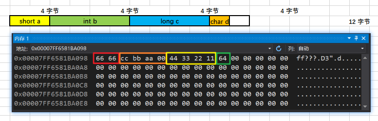

# C/C++ 内存对齐

## 零、前言

在编写代码的时候发现在定义一个结构体如下，sizeof(H5IOBuf)返回的结果为68

```
typedef struct {
    unsigned int    dataLen;
    unsigned char   data[0x20];
    unsigned char	slcTDESKey[0x1E];
    unsigned char	opeType;	// 0, 1, 2
} H5IOBuf;
```

而将opeType变量提前的之后，sizeof(H5IOBuf)得到的结果为72

```
typedef struct {
    unsigned char	opeType;	// 0, 1, 2
    unsigned int    dataLen;
    unsigned char   data[0x20];
    unsigned char	slcTDESKey[0x1E];
} H5IOBuf;
```

观察内存视图发现在第二种讲char提前到结构体最前面的时候，相邻的4个字节全部被算到结构体的内存内，也就是openType的大小为1字节，的地址为0x00，按照结构体设计，dataLen的地址应为0x01，而此时dataLen的地址为0x04

## 一、什么是内存对齐

简单来说，就是方便计算机去读写数据。对齐的地址一般都是 n（n = 2、4、8）的倍数。

- 1 个字节的变量，例如 char 类型的变量，放在任意地址的位置上；
- 2 个字节的变量，例如 short 类型的变量，放在 2 的整数倍的地址上；
- 4 个字节的变量，例如 float、int 类型的变量，放在 4 的整数倍地址上；
- 8 个字节的变量，例如 long long、double 类型的变量，放在 8 的整数倍地址上；

## 二、内存对齐规则

**通常情况**：我总结的规律如下：结构体中间：各结构体的起始地址按照各个类型变量默认规则进行摆放，但除了 char 类型变量（详见一），char 类型变量一般遵循 2 的倍数地址开始存储。详见例2。结构体最后（重要）：视结构体中最大类型是哪一个，如果是像 int 类型那样是 4 个字节的，并且结构体的结尾地址不满足 4 的倍数的话，向离最近的 4 的倍数地址补齐；如果是像 double 类型那样是 8 个字节的，并且结构体的结尾地址不满足 8 的倍数的话，向离最近的 8 的倍数地址补齐；以此类推。。。。

**结构体嵌套**：子结构体的成员变量**起始地址要视子结构体中最大变量类型决定**，比如 struct a 含有 struct b，b 里有 char，int，double 等元素，那 b 应该从 8 的整数倍开始存储。详见例5、例6。 

**含数组成员**：比如 char a[5]，它的对齐方式**和连续写 5 个 char 类型变量是一样的，也就是说它还是按一个字节对齐**。详见例1、例2、例3、例4、例5。

**含联合体（union）成员**：取联合体中**最大类型**的整数倍地址开始存储。详见例5。

### 三、影响内存对齐的情况

1. 变量排列顺序。
2. `__attribute__((packed))`：取消变量对齐，按照实际占用字节数对齐（就是让变量之间排列紧密，不留缝隙）。（gcc才支持）详见例7。
3. `#pragma pack (n)`：让变量强制按照 n 的倍数进行对齐，并会影响到结构体结尾地址的补齐（详见四的通常情况下关于结尾地址补齐的描述）。详见例8。

## 四、基本变量类型占用内存空间大小

| 数据类型      | ILP32（32位Linux系统） | LP64（64位Linux系统）  | LLP64（64位Windows系统） |
| ------------- | ---------------------- | ---------------------- | ------------------------ |
| char          | 1 字节                 | 1 字节                 | 1 字节                   |
| short         | 2 字节                 | 2 字节                 | 2 字节                   |
| int           | 4 字节                 | 4 字节                 | 4 字节                   |
| float         | 4 字节                 | 4 字节                 | 4 字节                   |
| **long**      | **4 字节**             | **8 字节**             | **4 字节**               |
| double        | 8 字节                 | 8 字节                 | 8 字节                   |
| long long     | 8 字节                 | 8 字节                 | 8 字节                   |
| **指针point** | **4 字节**             | **8 字节**             | **8 字节**               |
| 枚举enum      | 4 字节                 | 4 字节                 | 4 字节                   |
| 联合体union   | 取最大一个变量类型大小 | 取最大一个变量类型大小 | 取中最大一个变量类型大小 |

## 五、例子

*一般为64位系统！*

**例1：研究结构体最后一个成员内存对齐问题1**

```cpp
// Windows 10：48 字节    Ubuntu 18.04：48 字节
struct stu1 {
    char a[18];
    double b;
    char c;
    int d;
    short e;
};
```


**例2：研究结构体最后一个成员内存对齐问题2**

```cpp
// Windows 10：44 字节    Ubuntu 18.04：44 字节
struct stu1 {
    char a[18];
    int b[3];
    short c;
    char d;
    int e;
    short f;
};
```


**例3：研究数组的内存对齐**

```cpp
// Windows 10：20 字节    Ubuntu 18.04：20 字节 
struct stu1 {
    int a;
    char b[8];
    float c;
    short d;
};
```


**例4：枚举 & 研究数组之间的内存对齐**

```cpp
// Windows 10：32 字节    Windows 10（32位）：24 字节    Ubuntu 18.04：32 字节
enum DAY {
    MON = 1, TUE, WED, THU, FRI, SAT, SUN
};
struct stu1 {
    char a[5];
    char b[3];
    enum DAY day;
    int *c;
    short d;
    int e;
};
```

64位：


32位：


**例5：结构体嵌套1**

```cpp
// Windows 10：40 字节    Ubuntu 18.04：40 字节
struct stu2 {
    char x;
    int y;
    double z;
    char v[6];
};
struct stu1 {
    union u1 {
        int a1;
        char a2[5];
    }a;
    struct stu2 b;
    int c;
};
```


**例6：结构体嵌套2**

```cpp
// Windows 10：40 字节    Ubuntu 18.04：40 字节
struct stu2 {
    char x;
    int y;
    double z;
    char v[6];
};
struct stu1 {
    char a;
    struct stu2 b;
    int c;
};
```


**例7：`__attribute__((packed))`** 

由于 VS 和 VScode 均不支持`__attribute__((packed))`，于是只使用 gcc 编译。 

```cpp
// Ubuntu 18.04：19 字节
struct __attribute__((packed)) stu1 {    // 取消内存对齐
    char a;
    long b;
    short c;
    float d;
    int e;
};
```


**例8：#pragma pack (n)**

```cpp
// Windows 10：12 字节    Ubuntu 18.04：16 字节
#pragma pack (2)    // 强制以 2 的倍数进行对齐
struct stu1 {
    short a;
    int b;
    long c;
    char d;
};
#pragma pack ()    // 取消强制对齐，恢复系统默认对齐
```

 **正常情况：**

 

Windows 10：



Ubuntu 18.04：


