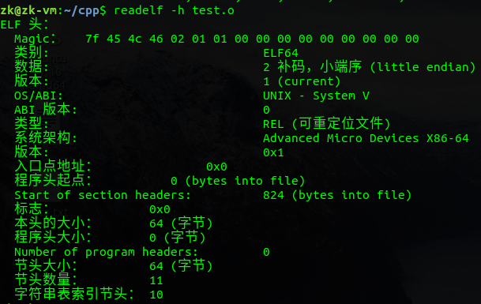
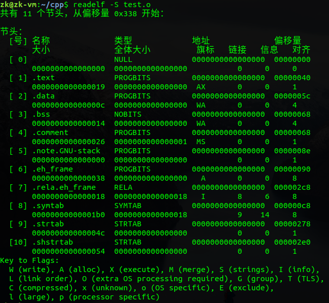

# 从编写源代码到程序在内存中运行的全过程解析

[TOC]

## 零、前言

作为一个C/C++程序员，搞清楚从编写源代码到程序运行过程中发生的细节是很有必要的。这在之前也是困扰我的一个很大问题，因为最近在忙着找实习，一直没有下定决心来写这篇博客，最近才抽时间写。下面的代码除了明显贴出来的以外，其他的都以下面的代码为例进行说明： 

```
#include <stdio.h>

int gdata1 = 10;
int gdata2 = 0;
int gdata3;
 
static int gdata4 = 11;
static int gdata5 = 0;
static int gdata6;
 
int main(void)
{
	int a = 12;
	int b = 0;
	int c;

	static int d = 13;
	static int e = 0;
	static int f;
	return 0;
}
```

## 一、基本概念

### 1. 什么是数据

大家平时口中经常说程序是由程序代码、数据和进程控制块组成，但是很多人却不知道什么是数据。这里我们搞清楚两件事情，一是什么是数据，二是数据存放在哪里

(1) 数据

数据指的是称序中定义的全局变量和静态变量。还有一种特殊的数据叫做常量。所以上面的的gdata1、gdata2、gdata3、gdata4、gdata5、gdata6、d、e和f均是数据

(2) 数据存放在哪里

数据存放的区域有三个地方：`.data`段、`.bss`段和`.rodata`段。那么你肯定想知道数据是如何放在这三个段中的，怎么区分

对于初始化不为0的全局变量和静态变量存放在`.data`段，即gdata1、gdata4和d存放在.data段；对于未初始化或者初始化值为0的段存放在`.bss`段中，而且不占目标文件的空间，即gdata2、gdata3、gdata5、gdata6、e和f存放在`.bss`段。文章下面有一张关于符号表的图，大家可以看到确实是这样的分布

而对于字符串常量则存放在`.rodata`段中，而且对于字符串而言还有一个特殊的地方，就是它在内存中只存在一份。下面给个代码来测试：

```
#include <stdio.h>
int main(void)
{
	const char *pStr1 = "hello,world";
	const char *pStr2 = "hello,world";
	// 输出的地址是一致的。因为敞亮字符串“hello,world”只存在一份
	printf("0x%x\n", pStr1);
	printf("0x%x\n", pStr2);
	return 0;
}
```

### 2. 什么是指令

说完了数据，那什么是指令呢？也就是什么是程序代码。很简单，程序中除了数据，剩下的就都是指令了。这里有一个容易混淆的地方，如下面的代码：

```
#include <stdio.h>
int main()
{
    int a = 10;
    int b = 20;
    printf("a + b = %d\n", a + b);
    return 0;
}
```

大家可能会有一个疑问，就是对于上面的代码，a和b明明是局部变量，难道不是数据吗？嗯，它真的不是数据，它是一条指令，这条指令的功能是在函数的栈帧上开辟四个字节，并向这个地址上写入指定值

### 3. 什么是符号

说完数据和指令，接下来是另一个基础而且重要的概念，那就是符号。我们在编写程序完，进行链接时会碰到这样的错误："*错误    LNK1169    找到一个或多个多重定义的符号*"，即符号重定义。那什么是符号，什么东西会产生符号，符号的作用域又是怎样的呢？

在程序中，所有数据都会产生符号，而对于代码段只有函数名会产生符号。而且符号的作用域有`global`和`local`之分，对于未用`static`修饰过的全局变量和函数产生的均是`global`符号，这样的变量和函数可以被其他文件所看见和引用；而使用`static`修饰过的变量和函数，它们的作用域仅局限于当前文件，不会被其他文件所看见，即其他文件中也无法引用`local`符号的变量和函数

对于上面的"*找到一个或多个多重定义的符号*" 错误原因有可能是多个文件中定义同一个全局变量或函数，即函数名或全局变量名重了

### 4. 虚拟地址空间布局

对于32位操作系统，每个操作系统都有2^32字节的虚拟地址空间，即4G的虚拟地址空间。这4G的虚拟地址空间分为两个大部分：每个进程独立的3G的用户空间，和所有进程共享的1G的内核空间。具体分布如下图：


> 为什么前128M是不可访问的，而不是256M？ 

## 二、编译过程

### 1. 编译

整个编译分为四个步骤：

0. 首先编写源文件 `main.c` / `main.cpp`

1. **预编译（Preprocessing）**：编写好代码以后进行预编译成 `main.i` 文件，预编译过程中去掉注释、进行宏替换、增加行号信息等
   - 预处理器会处理以 `#` 开头的指令，比如 `#include`、`#define`、`#ifdef` 等。
   - 预处理阶段会将所有的宏替换展开、移除注释、处理条件编译指令，生成一个纯文本的代码文件（通常是 `.i` 文件）。
   - 例如，将 `#include <iostream>` 替换为 `<iostream>` 文件的实际内容。
2. **编译（Compilation）**：然后将 `main.i` 文件经过语法分析、代码优化和汇总符号等步骤后，编译形成 `main.s` 的汇编文件，里面存放的都是汇编代码
   - 编译器将预处理后的代码（`.i` 文件）转换为汇编代码（通常是 `.s` 文件）。
   - 在此阶段，编译器会对代码进行语法和语义分析，进行优化，生成与源代码对应的汇编代码。
   - 汇编代码是人类可读的低级代码，接近机器指令，但还不是真正的二进制代码。
3. **汇编（Assembly）**：使用汇编器将汇编代码 `main.s` 转换成 `main.o` 二进制格式机器代码文件
   - 汇编器将汇编代码（`.s` 文件）转化为机器代码（`.o` 或 `.obj` 文件）。
   - 这个阶段生成的机器代码是二进制格式，但不包含完整的可执行程序信息，只是包含对应代码的片段，因此称为目标文件。
4. **链接（Linking）**：最后一个编译步骤是进行链接，将各个目标文件 `main.o` 与所需的库文件进行链接，生成最终的可执行文件
   - 链接器将各个目标文件（`.o` 或 `.obj` 文件）与所需的库进行链接，生成最终的可执行文件。
   - 链接过程包括将不同的目标文件合并、解决外部符号引用（比如函数或变量），并将需要的库（如标准库）嵌入到可执行文件中。
   - 最终生成的文件可以直接在操作系统上运行（如 Linux 的 ELF 文件或 Windows 的 .exe 文件）。

以上四个步骤对应的在 `GNU GCC` 下的命令为：

```shell
gcc -E main.c -o main.i  #预编译，生成main.i文件
gcc -S main.i            #编译，生成main.s文件
gcc -c main.s            #汇编，生成main.o文件
gcc main.o -o main       #链接，生成可执行文件
```

#### GCC常用的编译选项

| 选项          | 作用                                                         |
| ------------- | ------------------------------------------------------------ |
| -o            | 指定输出文件名称                                             |
| -E            | 只进行预处理                                                 |
| -S            | 只进行预处理、编译                                           |
| -c            | 只预处理、编译、汇编，但不链接                               |
| -D            | 使用`-D name[=definition]`预定义名为name的宏，若不指定值则默认宏的内容为1 |
| -l（小写的L） | 使用`-l libname`或者`-llibname`，使链接器在链接时搜索名为libname.a/libname.so（静态/动态）的库文件 |
| -L            | 使用`-Ldir`添加搜索目录，即链接器在搜索-l选项指定的库文件时，除了系统的库目录还会（优先）在-L指定的目录下搜索 |
| -I（大写的i） | 使用`-I dir`，将目录dir添加为头文件搜索目录                  |
| -include      | 使用`-include file`，等效于在被编译的源文件开头添加#include "file" |
| -static       | 指定静态链接(默认是动态链接)                                 |
| -O0~3         | 开启编译器优化，`-O0`为不优化，`-O3`为最高级别的优化         |
| -Os           | 优化生成代码的尺寸，使能所有`-O2`的优化选项，除了那些让代码体积变大的 |
| -Og           | 优化调试体验，在保留调试信息的同时保持快速的编译，对于生成可调试代码，比`-O0`更合适，不会禁用调试信息。 |
| -Wall         | 使编译器输出所有的警告信息                                   |
| -march        | 指定目标平台的体系结构，如`-march=armv4t`，常用于交叉编译    |
| -mtune        | 指定目标平台的CPU以便GCC优化，如`-mtune=arm9tdmi`，常用于交叉编译 |

### 2. 二进制可重定位目标文件的结构和布局

首先给出一个二进制可重定位目标文件（Linux下是*.o文件，windows中是*.obj文件）的总体布局，简单来说整个obj文件就是由ELF header+各种段组成：


二进制可重定位文件的头部，可以看到ELF header占64个字节，里面存放着文件类型、支持的平台、程序入口点地址等信息，如果你对每个字段的具体含义感兴趣，可以看《程序员自我修养》：



接下来就是目标文件的各个段，从下面可以看到数据和指令在目标文件中是按段的形式组织起来的，而且.text段的起始位置从file off字段可以看到是0x40位置，即64字节处，也说明.text段是接在ELF header后面


代码段的大小为0x19，起始偏移为0x40，所以.data段的起始偏移应该为0x19+0x40=0x59，但是为了字节对齐，所以。data段的起始地址为0x5c，也即图中file off字段所示，后面的段以此类推

之后的`.bss`段会出现两个问题，一个是`.bss`段的大小应该为4\*6=24字节，但是实际上却是20字节；另一个问题就是可以看到`.comment`段的偏移(file off)也为0x68，这说明`.bss`段在目标文件中是不占大小的，即`.comment`和`.bss`段的偏移相同。对于这两个问题，我这里不作详细介绍，简单说一下。第一个问题，涉及到C语言中的强符号和弱符号概念；第二个问题我们可以这样理解，因为`.bss`段中存的是初始化为0或者未初始化的数据，而实际未初始化的数据其默认值也为0，这样我们就没必要存它们的初始值，相当于有一个默认值0

上面的图只列出了部分段，下面查看一下目标文件中所有的段，一共有11个段，简单说明一下，`.comment`是注释段、`.symtab`是符号表段



接下来就是看段的详细内容，可以看到各个段真实的存储内容如下，下面最明显的是.data段，里面存放着gdata1、gdata4和d的值分配为0x0000000a(10)、0x0000000b(11)和0x0000000d(13)，正好与代码中的初始值匹配。注意下面显示的小端模式。


以上就是可重定位目标文件的组成，下面再介绍一下上面提到的符号表如下图，第一列是符号的地址，由于编译的时候不分配地址，所以放的是零地址或者偏移量；第二列是符号的作用域（g代表`global`，l代表`local`），前面讨论了用`static`修饰过的符号均是`local`的（不明白的搜一下static关键字的作用），如下图中gdata4/gdata5/gdata6等；第三列表示符号位于哪个段，在这里也能看到gdata1、gdata4和d都存放在`.data`段中，初始化为0或未初始化的gdata2/gdata5/gdata6等都存放在`.bss`段：


 这里特别说一下gdata3，按上面的分析来说它应该是存放在`.bss`段，但是我们可以看到它是\*COM\*，原因在于它是一个弱符号，在编译时无法确定有没有强符号会覆盖它。 

## 三、链接过程

### 1. 链接

链接过程分为两步，第一步是合并所有目标文件的段，并调整段偏移和段长度，合并符号表，分配内存地址；第二步是链接的核心，进行符号的重定位。

1. 合并段：所有相同属性的段进行合并，组织在一个页面上，这样更节省空间。如.text段的权限是可读可执行，.rodata段也是可读可执行，所以将两者合并组织在一个页面上；同理合并.data段和.bss段。

2. 合并符号表：链接阶段只处理所有obj文件的global符号，local符号不作任何处理。

3. 符号解析：符号解析指的是所有引用符号的地方都要找到符号定义的地方。

4. 分配内存地址：在编译过程中不分配地址（给的是零地址和偏移），直到符号解析完成以后才分配地址。如下图，数据的零地址：


5.  符号重定位：因为在编译过程中不分配地址，所以在目标文件所以数据出现的地方都给的是零地址，所有函数调用的地方给的是相对于下一条指令的地址的偏移量。在符号重定位时，要把分配的地址回填到数据和函数调用出现的地方，而且对于数据而言填的是绝对地址，而对函数调用而言填的是偏移量


## 四、可执行程序

链接完成以后形成了可执行文件，下面来解析可执行文件是如何执行起来的。同样，首先给出可执行文件的总体布局，然后再来深入解析


首先看一下可执行文件的头部，如下图，里面记录了函数的入口点地址为0x08048094(后面会解释这个值的来由)，还有就是size of this headers，程序头部占52个字节，然后还有三个program headers，每个program headers占32字节，共占3\*32=96字节，所以程序头部+program heades = 52 + 96 = 0x94，而从虚拟地址空间布局可知`.text`段正好是从0x08048000开始的，所以可执行程序的入口点就是0x08048000 + 0x94 = 0x08048094：


然后看看这三个program headers里面的内容，第一个load项的属性是可读可执行，其实存放的就是代码段；第二个load项的属性是可读可写，其实存放的就是数据段。这两个load项的意义在于它指示了哪些段会被加载到同一个页面中：


可以看到这两个load项的对齐方式是页面对齐（32位linux操作系统页面大小为4K）

当双击一个可执行程序时，首先解析其文件头部ELF header获取entry point address程序入口点地址，然后按照两个load项的指示将相应的段通过mmap()函数映射到虚拟页面中（虚拟页面存在于虚拟地址空间中），最后再通过多级页表映射将虚拟页面映射到物理页面中。


## 五、地址映射过程

最后说明如何将VP映射到PP就打工告成了。

分为三步

1. 首先是创建虚拟地址到物理内存的映射（创建内核地址映射结构体），创建页目录和页表
2. 再就是加载代码段和数据段
3. 把可执行文件的入口地址写到CPU的PC寄存器中

实验环境是在32位Linux操作系统下的虚拟地址映射过程。先将逻辑地址通过GDTR/LDTR转换为线性地址（也叫虚拟地址），然后再通过多级页表映射（32位地址需要两级页表映射）将线性地址转换为物理地址。       

以某个函数中局部变量的地址映射过程为例进行说明。

我们知道在保护模式下，局部变量存放在栈中，而栈的信息存放在栈寄存器SS中，首先我们通过栈寄存器的低两位判断是存在用户空间中还是内核空间中，应用程序肯定是在用户空间中。然后通过第3位判断使用的是LDT(局部段描述符表)还是GDT(全局段描述符表)，实验发现32位Linux下使用的是LDT，此时SS的高13位则作为索引，判断该局部变量的存放的段的信息在LDT的哪一项。

GDT中存放的是LDT每一项的具体信息，如LDT的其实地址等信息。此时要根据LDTR来找到该信息存放到了GDT的哪一项，此时可以通过LDTR作为GDT的索引，找到LDT的起始地址。

找到LDT的起始地址以后，再根据SS寄存器中的高13位作为索引，找到段的存放数据的段的起始地址(32位)，将起始地址加上偏移量即可得到线性地址。那这个偏移量又怎么得到呢，很简单，这个偏移量也就是我们所谓的逻辑地址，也是CPU发出来的地址，我们可以通过在程序中对该局部变量取地址即可得到。

得到线性地址以后，查看CR0寄存器的最高位PG位，这一位为0表示没有开启内存分页，如果为1则表示开启了内存分页。Linux下基本都会开启内存分页机制。此时得到的线性地址也叫做虚拟地址。这个地址总共32位，分成10+10+12三段，其中高10位地址指示页目录项，次高10位地址指示也表项，最后的12位指示该局部变量在物理内存页面中的偏移量。    

从线性地址到物理地址的具体映射过程如下。首先根据CR3寄存器中的值得到页目录的起始地址，然后根据高10位找到指示的页表项，再根据次高10位找到对应的物理页面的起始地址，最后加上低12位的偏移量即可得到局部变量的物理地址。

