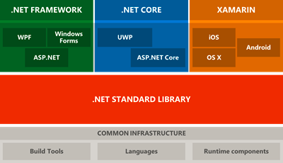

# .NET Framework 与 .NET Core 的区别与联系

 **当今 .Net 生态系统如下：** 

从上面图中我们可以看到.net  主要分为三个部分 `.Net Framework`、`.Net Core`、`Xamarin`

- **XAMARIN**：主要用来构建APP的（包括IOS，Android Windows）主要用的是C#语言
- **The .NET Framework**：这个是我们现在经常用的，用这个可以创建Windows应用程序还有web applications，现在你可以用它创建Winform、UWP、wpf等等相关的应用程序，web方面就是Asp.Net MVC
- **.NET Core**：是微软推出的最新的开源、跨平台的框架，用它创建的应用可以运行在MAC、Linux上 。.Net Core 支持UWP（Windows 10中的Universal Windows Platform）和ASP.NET Core。即Windows通用应用平台，在Win 10 Mobile/Surface/PC/Xbox/HoloLens等平台上运行，UWP不同于传统PC上的exe应用也跟只适用于手机端的app有本质区别。它并不是为某一个终端而设计，而是可以在所有Windows10设备上运行

## 优缺点：

.NET Core和.Net Framwork 各有优缺点，两者都不能取代对方。

**.Net Framwork 主要适用于：**

- 没时间学习新技术
- 需要一个很稳定的运行环境，最近学习发布稳定版本
- 已经在使用现有的应用程序并扩展其功能
- 现在已经有专门的.net团队来实现客户所需要的功能
- 不想经常更新程序

**.Net Core 更适用于以下几个方面：**

- 程序需要多系统运行，包括MAC，windows和Linux等系统
- 不怕学习新东西，不怕出现的各种疑难杂症，毕竟.net core 刚出生没多久，肯定很多东西考虑的不是特别全面
- 热爱开源，最好是刚接触.net 的

**说了这么多画个图表给大家看看吧**

| Docker容器支持                                          | 都支持，.net Core就是以Docker为基础的            |
| ------------------------------------------------------- | ------------------------------------------------ |
| 在命令行上重复回复                                      | .Net Core更快                                    |
| 跨平台                                                  | 仅.Net Core支持                                  |
| Windows client applications using Windows Forms and WPF | .Net Framework                                   |
| 已经有一个预配置的环境和系统                            | .Net Framework                                   |
| 系统稳定性                                              | .Net Framework 更胜一筹，毕竟 .Net Core 才刚发布 |
| 是否有一个成熟的团队                                    | .Net Core 需要一个学习曲线                       |
| 未来咋样                                                | .Net Core 就是未来                               |

**注意，并不是所有的 .Net Framework 都可以直接运行在 .Net Core 上**