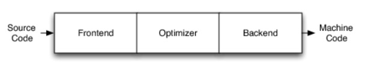

# 深入浅出的理解LLVM

## 什么是LLVM

LLVM项目是模块化、可重用的编译器以及工具链技术的集合

美国计算机协会 (ACM) 将其2012 年软件系统奖项颁给了LLVM，之前曾经获得此奖项的软件和技术包括:Java、Apache、 Mosaic、the World Wide Web、Smalltalk、UNIX、Eclipse等等

创始人:Chris Lattner，亦是Swift之父

趣闻：Chris Latter本来只是想写一个底层的虚拟机，这也是LLVM名字的由来，low level virtual machine，跟Java的JVM虚拟机一样，可是后来，llvm从来没有被用作过虚拟机，哪怕LLVM的名气已经传开了。所以人们决定仍然叫他LLVM，更多的时候只是当作“商标”一样的感觉在使用，其实它跟虚拟机没有半毛钱关系。官方描述如下

*The name "LLVM" itself is not an acronym; it is the full name of the project. “LLVM”这个名称本身不是首字母缩略词; 它是项目的全名*


## 编译器架构

**传统编译器：**



| 名词                | 解释                                 |
| ------------------- | ------------------------------------ |
| Frontend（前端）    | 词法语法分析、语义分析、生成中间代码 |
| Optimizer（优化器） | 中间代码优化                         |
| Backend（后端）     | 生成机器码                           |

**LLVM架构：**


不同的前后端使用同一的中间码LLVM Intermediate Representation (LLVM IR)

如果需要支持一种新的编程语言，那么只需要实现一个新的前端

如果需要支持一种新的硬件设备，那么主需要实现一个新的后端

优化阶段是一个通用的阶段，他针对的是统一的LLVM IR，无论是支持新的编程语言，还是支持新的硬件设备，都不需要对优化阶段做修改

相比之下，GCC的前端和后端没分得泰开，前端和后端耦合在了一起。所以GCC为了支持一门新的语言，或者为了支持一个新的目标平台就变得特别困难

LLVM现在被作为实现各种静态和运行时编译语言的通用基础结构(GCC家族、Java、.NET、Python、Ruby、Scheme、Haskell、D等)


## Clang

Clang是LLVM项目的一个子项目，基于LLVM架构的C/C++/Objective-C编译器前端

**相比于GCC，Clang的优点：**

1. 编译速度快:在某些平台上，Clang的编译速度显著的快过GCC（Debug模式下编译OC速度比GGC快3倍）
2. 占用内存小:Clang生成的AST所占用的内存是GCC的五分之一左右
3. 模块化设计:Clang采用基于库的模块化设计，易于 IDE 集成及其他用途的重用
4. 诊断信息可读性强:在编译过程中，Clang创建并保留了大量详细的元数据(metadata)，有利于调试和错误报告
5. 设计清晰简单，容易理解，易于扩展增强

**Clang与LLVM的关系：**


LLVM整体架构，前端用的是clang，广义的LLVM是指整个LLVM架构，一般狭义的LLVM指的是LLVM后端（包含代码优化和目标代码生成）

源代码（C/C++）经过Clang --> 中间代码（经过一系列的优化，优化用的是Pass） --> 机器码


## 案例

### OC源文件的编译过程

这里用Xcode创建一个Test项目，然后cd到main.m的上一路径

命令行查看编译的过程:$ clang -ccc-print-phases main.m

```
$ clang -ccc-print-phases main.m 

0: input, "main.m", objective-c
1: preprocessor, {0}, objective-c-cpp-output
2: compiler, {1}, ir
3: backend, {2}, assembler
4: assembler, {3}, object
5: linker, {4}, image
6: bind-arch, "x86_64", {5}, image
```

0. 找到main.m文件
1. 预处理器，处理include、import、宏定义
2. 编译器编译，编译成ir中间代码
3. 后端，生成目标代码
4. 汇编
5. 链接其他动态库静态库
6. 编译成适合某个架构的代码

查看preprocessor(预处理)的结果:$ clang -E main.m
这个命令敲出，终端就会打印许多信息，大致如下：

```
# 1 "main.m"
# 1 "<built-in>" 1
# 1 "<built-in>" 3
# 353 "<built-in>" 3
# 1 "<command line>" 1
# 1 "<built-in>" 2
# 1 "main.m" 2
.
.
.
int main(int argc, const char * argv[]) {
	@autoreleasepool {
    	NSLog(@"Hello, World!");
	}
	return 0;
}
```

### 词法分析

生成Token: $ clang -fmodules -E -Xclang -dump-tokens main.m
将代码分成一个个小单元

```
void test(int a, int b){
    int c = a + b - 3;
}
void 'void'  [StartOfLine]  Loc=<main.m:18:1>
identifier 'test'    [LeadingSpace] Loc=<main.m:18:6>
l_paren '('     Loc=<main.m:18:10>
int 'int'       Loc=<main.m:18:11>
identifier 'a'   [LeadingSpace] Loc=<main.m:18:15>
comma ','       Loc=<main.m:18:16>
int 'int'    [LeadingSpace] Loc=<main.m:18:18>
identifier 'b'   [LeadingSpace] Loc=<main.m:18:22>
r_paren ')'     Loc=<main.m:18:23>
l_brace '{'     Loc=<main.m:18:24>
int 'int'    [StartOfLine] [LeadingSpace]   Loc=<main.m:19:5>
identifier 'c'   [LeadingSpace] Loc=<main.m:19:9>
equal '='    [LeadingSpace] Loc=<main.m:19:11>
identifier 'a'   [LeadingSpace] Loc=<main.m:19:13>
plus '+'     [LeadingSpace] Loc=<main.m:19:15>
identifier 'b'   [LeadingSpace] Loc=<main.m:19:17>
minus '-'    [LeadingSpace] Loc=<main.m:19:19>
numeric_constant '3'     [LeadingSpace] Loc=<main.m:19:21>
semi ';'        Loc=<main.m:19:22>
r_brace '}'  [StartOfLine]  Loc=<main.m:20:1>
eof ''      Loc=<main.m:20:2>
```

可以看出，词法分析的时候，将上面的代码拆分一个个token，后面数字表示某一行的第几个字符，例如第一个void，表示第18行第一个字符。

### 语法树-AST

语法分析，生成语法树(AST，Abstract Syntax Tree): $ clang -fmodules -fsyntax-only -Xclang -ast-dump main.m

通过语法树，我们能知道这个代码是做什么的

还是刚刚的test函数，生成语法树如下：

```
|-FunctionDecl 0x7fa1439f5630 <line:18:1, line:20:1> line:18:6 test 'void (int, int)'
| |-ParmVarDecl 0x7fa1439f54b0 <col:11, col:15> col:15 used a 'int'
| |-ParmVarDecl 0x7fa1439f5528 <col:18, col:22> col:22 used b 'int'
| `-CompoundStmt 0x7fa142167c88 <col:24, line:20:1>
|   `-DeclStmt 0x7fa142167c70 <line:19:5, col:22>
|     `-VarDecl 0x7fa1439f5708 <col:5, col:21> col:9 c 'int' cinit
|       `-BinaryOperator 0x7fa142167c48 <col:13, col:21> 'int' '-'
|         |-BinaryOperator 0x7fa142167c00 <col:13, col:17> 'int' '+'
|         | |-ImplicitCastExpr 0x7fa1439f57b8 <col:13> 'int' <LValueToRValue>
|         | | `-DeclRefExpr 0x7fa1439f5768 <col:13> 'int' lvalue ParmVar 0x7fa1439f54b0 'a' 'int'
|         | `-ImplicitCastExpr 0x7fa1439f57d0 <col:17> 'int' <LValueToRValue>
|         |   `-DeclRefExpr 0x7fa1439f5790 <col:17> 'int' lvalue ParmVar 0x7fa1439f5528 'b' 'int'
|         `-IntegerLiteral 0x7fa142167c28 <col:21> 'int' 3

`-<undeserialized declarations>
```

终端敲出的时候，终端很直观的帮我们用颜色区分。我们可以用图形显示如下：


test函数的语法树

### LLVM IR

LLVM IR有3种表示形式

| --   | --   |
| ---- | ---- |
| text   | 便于阅读的文本格式，类似于汇编语言，拓展名.ll，$clang -S -emit-llvm main.m |
| memory | 内存格式 |
| bitcode | 二进制格式，拓展名.bc，$clang -c -emit-llvm main.m |

```
; Function Attrs: noinline nounwind optnone ssp uwtable
define void @test(i32, i32) #2 {
  %3 = alloca i32, align 4
  %4 = alloca i32, align 4
  %5 = alloca i32, align 4
  store i32 %0, i32* %3, align 4
  store i32 %1, i32* %4, align 4
  %6 = load i32, i32* %3, align 4
  %7 = load i32, i32* %4, align 4
  %8 = add nsw i32 %6, %7
  %9 = sub nsw i32 %8, 3
  store i32 %9, i32* %5, align 4
  ret void
}
```

**IR基本语法**

注释以分号`;`开头
全局标识符以`@`开头，局部标识符以`%`开头
alloca，在当前函数栈帧中分配内存
i32，32bit，4个字节的意思
align，内存对齐
store，写入数据
load，读取数据
官网语法参考[/doc/LangRef.html]( https://links.jianshu.com/go?to=https%3A%2F%2F%2Fdocs%2FLangRef.html )


## 应用实践

### 源码下载

下载LLVM

```
$ git clone https://git./git/llvm.git
```

下载clang

```
$ cd llvm/tools
$ git clone https://git./git/clang.git
```

备注：clang是llvm的子项目，但是他们的源码是分开的，需要将clang放在llvm/tools目录下

### 源码编译

这里我们在终端敲出的clang是xcode默认内置clang编译器，我们自己要进行LLVM开发的话，需要编译属于我们自己的clang编译器

首先安装cmake和ninja（先安装brew，/）

```
$ brew install cmake
$ brew install ninja
```

ninja如果安装失败，可以直接从github获取release版放在`/usr/local/bin`中
https://github.com/ninja-build/ninja/releases

在LLVM源码同级目录下新建一个`llvm_build`目录，最终会在`llvm_build`目录下生成`build.ninja`

```
$ cd llvm_build
$ cmake -G Ninja ../llvm -DCMAKE_INSTALL_PREFIX=LLVM的安装路径
```

备注：生成build.ninja，就表示编译成功，-DCMAKE_INSTALL_PREFIX 表示编译好的东西放在指定的路径，-D表示参数

更多cmake相关选项，可以参考: /docs/CMake.html

接下来依次执行编译、安装指令

```
$ ninja
```

编译完成后`llvm_build`目录大概会展21.05G

```
$ ninja install
```

到这里就编译完成了

### 应用实践的参考

libclang、libTooling
官方参考:  https://clang./docs/Tooling.html
应用:语法树分析、语言转换等

Clang插件开发
1. https://clang./docs/ClangPlugins.html
2. https://clang./docs/ExternalClangExamples.html
3. https://clang./docs/RAVFrontendAction.html
应用:代码检查(命名规范、代码规范)等

Pass开发
官方参考:  /docs/WritingAnLLVMPass.html
应用:代码优化、代码混淆等

开发新的编程语言
1. /en/latest/index.html
2. /zh_CN/latest/

