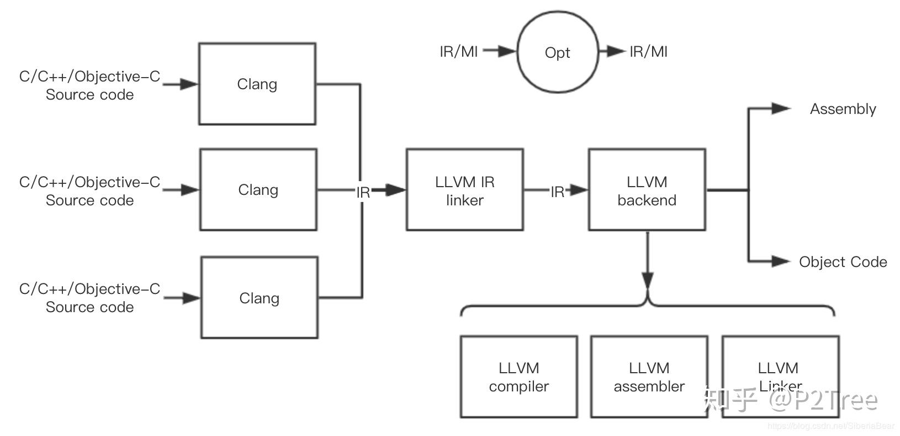

# LLVM

 Clang驱动程序把整个LLVM和clang都集成起来，和gcc的调用接口统一起来了 

### LLVM和Clang的背景

它最初的编写者，是一位叫做Chris Lattner([Chris Lattner's Homepage](https://link.zhihu.com/?target=http%3A//www.nondot.org/sabre/))的大神，硕博期间研究内容就是关于编译器优化的东西，发表了很多论文，博士论文是提出一套在编译时、链接时、运行时甚至是闲置时的优化策略，与此同时，LLVM的基本思想也就被确定了，这也让他在毕业前就在编译器圈子小有名气。

而在这之前，`Apple`公司一直使用`gcc`作为编译器，后来GCC对`Objective-C`的语言特性支持一直不够，Apple自己开发的GCC模块又很难得到GCC委员会的合并，所以老乔不开心。等到Chris Lattner毕业时，Apple就把他招入靡下，去开发自己的编译器，所以LLVM最初受到了Apple的大力支持。

LLVM最初设计时，因为只想着做优化方面的研究，所以只是想搭建一套虚拟机，所以当时这个的全称叫`Low Level Virtual machine`，后来因为要变成编译器了么，然后官方就放弃了这个称呼，不过LLVM的简称还是保留下来了。

因为LLVM只是一个编译器框架，所以还需要一个前端来支撑整个系统，所以Apple又拨款拨人一起研发了Clang，作为整个编译器的前端，Clang用来编译C、C++和Objective-C。所以当我接触Apple编译器时，当时的帖子里都说使用Clang/LLVM来和gcc做对比，当然是在代码优化、速度和敏捷性上比gcc强不少。这里我有两个文章，一个是gcc评价它在代码诊断方面和Clang的比较([ClangDiagnosticsComparison - GCC Wiki](https://link.zhihu.com/?target=https%3A//gcc.gnu.org/wiki/ClangDiagnosticsComparison))，另一个是Clang评价它和gcc（以及其他几个开源编译器）的优缺点([http://clang.llvm.org/comparison.html](https://link.zhihu.com/?target=http%3A//clang.llvm.org/comparison.html))，还是很客观的。相比来说，Clang/LLVM的完整性还不够，毕竟还在发展中。

对了，Clang的发音是`/ˈklæŋ/`，这是官方确认过的，我现在还在纠正发音过程中（后续：半个月后已纠正完毕，无缝衔接）。

后来Apple推出了Swift，也是基于LLVM作为编译器框架的。

至于Chris Lattner，17年的时候跳到了特斯拉，再后来去了Google，在TensorFlow团队，还是挺厉害的。而LLVM开源之后由LLVM委员会负责维护，当然发展势头也很猛。

### LLVM

LLVM是一个编译器框架。LLVM作为编译器框架，是需要各种功能模块支撑起来的，你可以将clang和lld都看做是LLVM的组成部分，框架的意思是，你可以基于LLVM提供的功能开发自己的模块，并集成在LLVM系统上，增加它的功能，或者就单纯自己开发软件工具，而利用LLVM来支撑底层实现。LLVM由一些库和工具组成，正因为它的这种设计思想，使它可以很容易和IDE集成（因为IDE软件可以直接调用库来实现一些如静态检查这些功能），也很容易构建生成各种功能的工具（因为新的工具只需要调用需要的库就行）。

请看下边这个图：



这个图是Clang/LLVM的简单架构。最初时，LLVM的前端是GCC，后来Apple还是立志自己开发了一套Clang出来把GCC取代了，不过现在带有Dragon Egg的GCC还是可以生成LLVM IR，也同样可以取代Clang的功能，我们也可以开发自己的前端，和LLVM后端配合起来，实现我们自定义的编程语言的编译器。

LLVM IR是LLVM的中间表示，这是LLVM中很重要的一个东西，介绍它的文档就一个，LLVM Language Reference Manual：[https://llvm.org/docs/LangRef.html](https://link.zhihu.com/?target=https%3A//llvm.org/docs/LangRef.html)（看名字就觉得大气，LLVM语言参考手册，但浩浩荡荡一大篇文章，读下来还是需要精力的），大多数的优化都依赖于LLVM IR展开。我把Opt单独画在一边，是为了简化图的内容，因为LLVM的一个设计思想是优化可以渗透在整个编译流程中各个阶段，比如编译时、链接时、运行时等。

在LLVM中，IR有三种表示，一种是可读的IR，类似于汇编代码，但其实它介于高等语言和汇编之间，这种表示就是给人看的，磁盘文件后缀为`.ll`；第二种是不可读的二进制IR，被称作位码（bitcode），磁盘文件后缀为`.bc`；第三种表示是一种内存格式，只保存在内存中，所以谈不上文件格式和文件后缀，这种格式是LLVM之所以编译快的一个原因，它不像gcc，每个阶段结束会生成一些中间过程文件，它编译的中间数据都是这第三种表示的IR。三种格式是完全等价的，我们可以在Clang/LLVM工具的参数中指定生成这些文件（默认不生成，对于非编译器开发人员来说，也没必要生成），可以通过`llvm-as`和`llvm-dis`来在前两种文件之间做转换。

能注意到中间有个LLVM IR linker，这个是IR的链接器，而不是gcc中的那个链接器。为了实现链接时优化，LLVM在前端（Clang）生成单个代码单元的IR后，将整个工程的IR都链接起来，同时做链接时优化。

LLVM backend就是LLVM真正的后端，也被称为LLVM核心，包括编译、汇编、链接这一套，最后生成汇编文件或者目标码。这里的LLVM compiler和gcc中的compiler不一样，这里的LLVM compiler只是编译LLVM IR。

### 与gcc的关系

如果是像我这样从gcc过来的人，会不容易完全理解他们的结构对应关系。

gcc的编译器，输入是源代码，输出是汇编代码，相当于是LLVM中Clang一级加上IR linker再加上LLVM compiler中的生成汇编代码部分（Clang输出可执行文件的一条龙过程，不会生成汇编文件，内部全部走中间表示，生成汇编码和生成目标文件是并列的）。

gcc的汇编器，输入是汇编代码，输出是目标文件，相当于是LLVM中的`llvm-mc`（这是另一个工具，Clang一条龙默认不走这个工具，但会调用相同的库来做汇编指令的下降和发射）。

gcc的链接器，输入是目标文件，输出是最终可执行文件，相当于LLVM中的Linker，现在LLVM Linker还在开发中（已释出，叫lld，但仍然不成熟），所以Clang驱动程序调起来的链接器还是系统链接器，可以选择使用gcc的ld（这块会很快变，LLVM社区必然会在lld成熟后默认换上去，大家可以自行验证）。

------

### 概念上的一词多义

通常提到LLVM和Clang，其实会有多个概念，比如我上边会说到Clang前端和Clang驱动程序，其实是Clang的两个概念，不同的概念需要在上下文中去分辨。我从官网文档中翻译出来这一段：

### LLVM

- LLVM项目或基础架构：这是对整个LLVM编译器框架的程序，包括了前端、优化器、后端、汇编器、链接器，以及libc++、JIT等。上下文如：“LLVM项目由以下几个模块组成”。
- 基于LLVM开发的编译器：这是指一部分或全部基于LLVM项目开发的编译器软件，软件可能基于LLVM的前端或后端来实现。上下文如：“我用LLVM将C语言编译到MIPS平台”。
- LLVM库：LLVM项目由库代码和一些工具组成，有时会指代LLVM库内容。上下文如：“我的项目使用了LLVM的即时编译框架”（JIT是其中一个库）。
- LLVM核心：在IR和后端算法上的内容，就是LLVM核心，也就是通常Clang/LLVM中的LLVM。上下文如：“LLVM和Clang是两个项目”。
- LLVM IR：有些时候也会指代其中间表示。上下文如：“Clang是一个前端，能将源代码翻译成LLVM”。

### Clang

通常我们在命令行上调用的clang工具，是Clang驱动程序，因为LLVM本质上只是一个编译器框架，所以需要一个驱动程序把整个编译器的功能串起来，clang能够监控整个编译器的流程，即能够调用到Clang和LLVM的各种库，最终实现编译的功能。

BTW，其实gcc也是驱动程序，由它将`cc`、`as`、`ld`等程序驱动起来。

如果由clang来监控运行，则整个IR的阶段，IR的表示形式都是内存形式，这样就不会在编译过程中产生中间文件，提高了编译的效率。另一种方法是调用LLVM的工具，类似于gcc中的`cc`、`as`、`ld`一样，LLVM也有自己的工具，这样工具之间运行需要用户来控制输入输出，这时的IR表示形式就是硬盘格式，可以是LLVM汇编（`.ll`），也可以是位码（`.bc`）。

------

### LLVM工具

前边总是提到LLVM工具，这一节介绍一下常用工具。LLVM工具用来调用LLVM的一部分库，实现库的功能，通常使用编译器的人会调用到这些工具。

有关于库和工具，我有个很形象的比喻，库就相当于厨房的各种厨艺和厨师，而工具就相当于前台和菜单，源程序就是我们带的食材，可执行文件就是最终的菜。我们总是需要通过前台来告诉我们需要吃什么菜，怎么吃，而前台负责调度后厨的哪些厨师和厨艺来加工这道菜，不同的前台输出的菜不完全相同，而它们可以调度相同的厨师去实现对应厨艺。

### opt

这是一个在IR级别做程序优化的工具，输入和输出都是同一类型的LLVM IR，很好理解，做优化不必要修改文件格式。设计编译器的同学会经常性的调用这个工具来验证自己的优化pass是否正确。

BTW，反过来，优化pass不一定作用于LLVM IR，比如作用于后端的MI，这时opt是不能使用的。

### llc

这是微观意义上的LLVM编译器，不同于gcc的编译器，它的输入是LLVM IR，输出是汇编文件或者是目标文件。通过`-filetype=asm`或者`-filetype=obj`来指定输出是汇编文件还是目标文件，若生成是目标文件，llc会调用LLVM中的汇编输出的代码库来工作（注意这个汇编器和gcc的汇编器也不同，它输入的是MI，是一种后端的中间表示）。除此之外，还可以用`-On`来指定优化级别（llc默认优化级别是`-O2`），或者其他一些参数。

```text
llc -filetype=asm main.bc -O0 -o main.s
llc -filetype=obj main.bc -O0 -o main.o
```

（`.bc`文件换成`.ll`文件也可以）

### llvm-mc

这是微观意义上的LLVM汇编器，它输入汇编文件，输出目标文件。同时，它也可以反汇编，指定特殊参数（--disassemble）就行。可以发现，llc和llvm-mc都会调用到输出目标文件的库，也就是`MCObjectStreamer`。

有关于这个工具，可以查看这个比较老旧的文档来学习：[Intro to the LLVM MC Project](https://link.zhihu.com/?target=http%3A//blog.llvm.org/2010/04/intro-to-llvm-mc-project.html)，有些东西是变了的，要批判的看 \逃。

### lli

这个工具是LLVM IR的解释器，也是一个JIT编译器。我其实从这里才知道，原来谈C语言是一门编译型语言，并不客观，因为LLVM可以把C语言翻译成LLVM IR，然后解释执行，与Java的那一套类似，这也是最初LLVM编写时的实现（一个虚拟机运行IR）。

### llvm-link

最早看到这个工具，以为是链接器，其实它是IR级别的链接器，链接的是IR文件。谈到这里，可以说一下LLVM针对多个源文件编译时的两种目标码输出方式。

1. 第一种是LLVM先通过前端把每个源文件单独翻译成IR级别，然后用llvm-link链接成一个IR，然后再经过优化、后端等步骤生成目标文件，使用llvm-link的同时，可以使用链接时优化。不过需要注意，这种方式同样需要最终调用链接器，将这个目标文件链接成可执行文件。
2. 第二种是LLVM通过前端把每个源文件单独翻译后，再单独经过优化、后端等工作，将每个源文件生成目标文件，之后再调用链接器，将所有目标文件链接成可执行文件。

```text
llvm-link main.bc sum.bc -o sum.linked.bc
```

### llvm-as

这是针对LLVM IR的汇编器，其实名字里带as，实际上不是gcc那个as，它的功能是将`.ll`文件翻译为`.bc`文件，LLVM项目里，`.ll`称为LLVM汇编码，所以llvm-as也就是IR的汇编器了。

### llvm-dis

与llvm-as刚好相反，IR的反汇编器，用来将`.bc`文件翻译为`.ll`文件。

### clang

最后也提一下clang，毕竟它也是现在LLVM项目中一个很重要的前端工具。clang能够调用起来整个编译器的流程，也就是上边其他工具调用的库，它很多都同样会调用。clang通过指定`-emit-llvm`参数，可以配合`-S`或`-c`生成`.ll`或`.bc`文件，这样我们就能把Clang的部分和LLVM的后端分离开来独立运行，对于观察编译器流程来说，很实用。

```text
clang -emit-llvm -c main.c -o main.bc
clang -emit-llvm -S main.c -o main.ll
```

还有一些其他工具，就不举例了，可以查看LLVM项目路径下`/src/tools/`中查看。