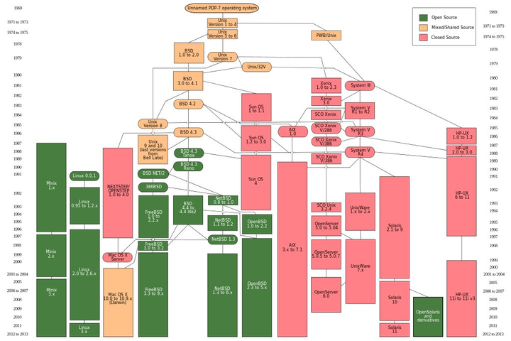
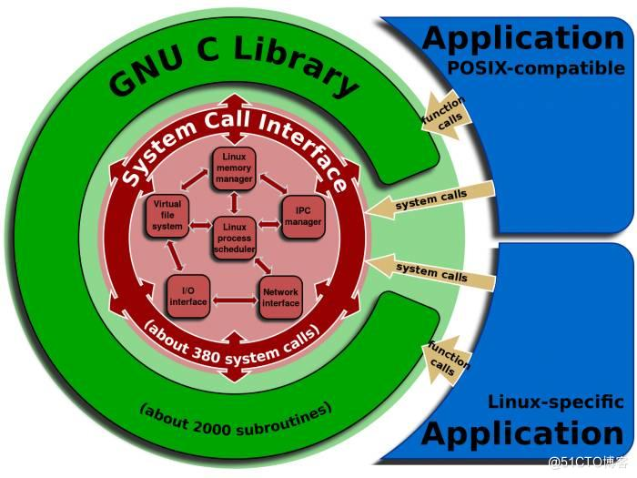
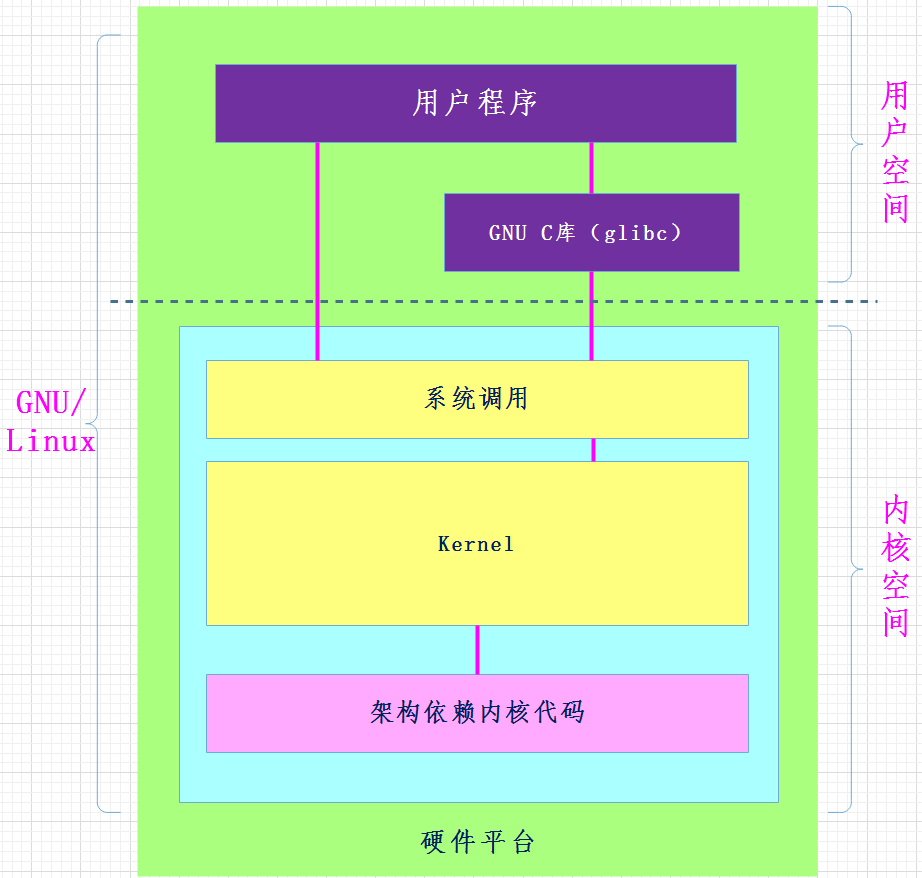
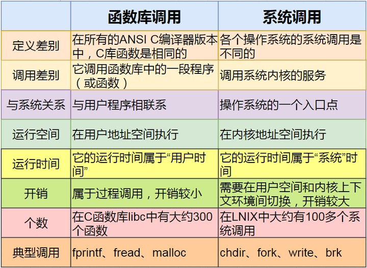
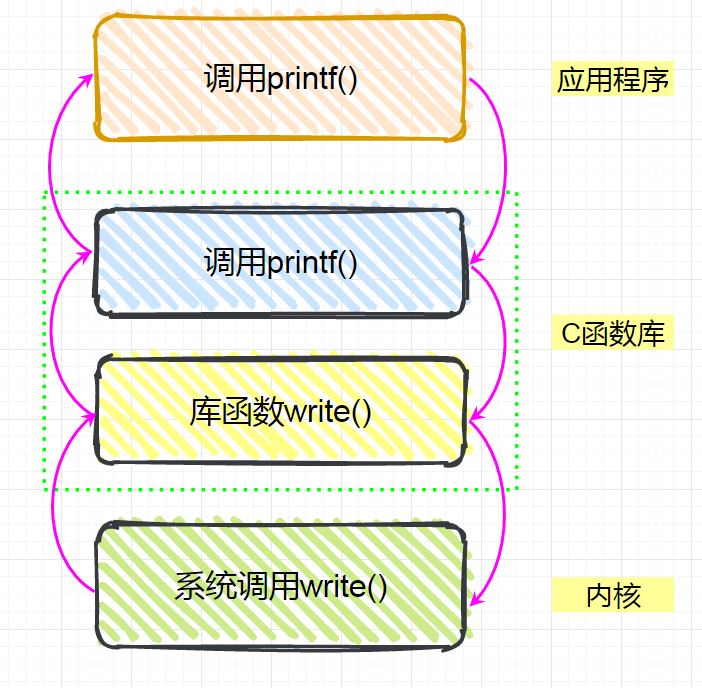
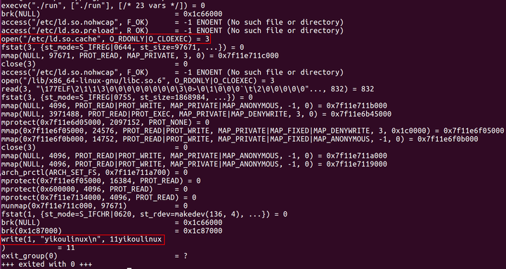
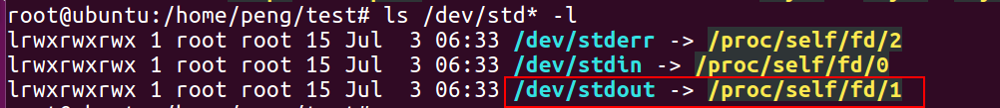

# POSIX-标准化的操作系统接口

## 概念

### 简介

POSIX（Portable Operating System Interface for UNIX）是一个标准化的操作系统接口，旨在提高不同UNIX系统之间的兼容性和可移植性。它定义了一组接口规范，包括系统调用、库函数和命令行工具，以确保在不同的UNIX操作系统上编写的应用程序可以在不进行重大修改的情况下移植到其他UNIX系统上运行。

POSIX标准的目标是促进UNIX操作系统之间的互操作性，使开发人员能够编写可移植的应用程序。一些主要的POSIX标准包括：

1. **POSIX.1**：这是最早的POSIX标准，定义了基本的系统调用、库函数和命令行工具。它包括了一些常见的UNIX功能，如文件操作、进程管理、信号处理和用户权限。
2. **POSIX.2**：这个标准扩展了POSIX.1，添加了一些附加的命令行工具和库函数，包括正则表达式、多线程支持和国际化字符处理。
3. **POSIX.1b**：也被称为实时POSIX，定义了对实时应用程序的支持，包括实时调度、信号量、消息队列和共享内存。
4. **POSIX.1c**：这个标准涵盖了可移植的网络编程接口，如套接字。
5. **POSIX.1d**：也称为安全POSIX，包括了一些安全性相关的接口，如访问控制列表（ACL）。

POSIX标准的目标是提供一种通用的编程接口，使开发人员能够轻松编写可移植的应用程序，而不必担心在不同的UNIX变种之间出现不兼容性。这有助于降低开发和维护成本，并使应用程序能够在多个UNIX系统上广泛使用。尽管POSIX最初是为UNIX系统设计的，但它的一些特性和接口已经被许多其他操作系统采纳和实现，以提高跨平台兼容性。

### POSIX标准下载

主页：[http://blog.csdn.net/ablo_zhou](https://link.zhihu.com/?target=http%3A//blog.csdn.net/ablo_zhou)

很多人听说了POSIX标准，但标准具体长什么样，在哪里下载到，则 不清楚。现在我开放出来，供相关人员使用。

Single UNIX Specification V3，IEEE Std 1003.1,2004 Edition

标准线上地址： [http://www.unix.org/version3/online.html](https://link.zhihu.com/?target=http%3A//www.unix.org/version3/online.html) 注册后可以在线阅读或者下载

IEEE和Open Group 的POSIX认证： [http://www.opengroup.org/certification/idx/posix.html](https://link.zhihu.com/?target=http%3A//www.opengroup.org/certification/idx/posix.html)

相关页面： [http://www.unix.org/version3/ieee_](https://link.zhihu.com/?target=http%3A//www.unix.org/version3/ieee_std.html)

## 历史

### 1. 起源

POSIX是Unix的标准。

1974年，贝尔实验室正式对外发布Unix。因为涉及到反垄断等各种原因，加上早期的Unix不够完善，于是贝尔实验室以慷慨的条件向学校提供源代码，所以Unix在大专院校里获得了很多支持并得以持续发展

于是出现了好些独立开发的与Unix基本兼容但又不完全兼容的OS，通称Unix-like OS

包括：

1. 美国加州大学伯克利分校的Unix4.xBSD(Berkeley Software Distribution)
2. 贝尔实验室发布的自己的版本，称为System V Unix
3. 其他厂商的版本，比如Sun Microsystems的Solaris系统,则是从这些原始的BSD和System V版本中衍生而来

20世纪80

年代中期，Unix厂商试图通过加入新的、往往不兼容的特性来使它们的程序与众不同

局面非常混乱，麻烦也就随之而来了

为了提高兼容性和应用程序的可移植性，阻止这种趋势， IEEE(电气和电子工程师协会)开始努力标准化Unix的开发，后来由 Richard Stallman命名为“Posix”

这套标准涵盖了很多方面，比如Unix系统调用的C语言接口、shell程序和工具、线程及网络编程

### 2. 遵循该标准的系统

遵循该标准的系统

1. 首先就是Unix和Linux
2. 苹果的操作系统也是Unix-based的
3. Windows

有了这个规范就可以调用通用的API了，Linux提供的POSIX系统调用在Unix上也能执行，因此学习Linux的底层接口最好就是理解POSIX标准

Windows从WinNT开始就有兼容POSIX的考虑。这是因为当年在要求严格的领域，Unix地位比Windows高。为了把Unix用户拉到Windows阵营，被迫支持POSIX

现在Win10对 Linux/POSIX 支持好，则是因为Linux已经统治了廉价服务器市场。为了提高Windows的竞争力搞的

### 3. 支持POSIX-Linux成功的最重要一个因素

Linux之所以能够成功，有很多因素，但是支持POSIX标准无疑是它能够快速发展的最重要的一个因素

POSIX 标准的制定最后投票敲定阶段大概是 1991~1993 年间，而此时正是Linux 刚刚起步的时候，这个 UNIX 标准为 Linux 提供了极为重要的信息，使得 Linux 能够在标准的指导下进行开发，并能够与绝大多数 UNIX 操作系统兼容

在最初的 Linux 内核源码（0.01版、0.11版）中就已经为 Linux 系统与 POSIX 标准的兼容做好了准备工作

在 Linux 0.01 版内核 /include/unistd.h 文件中就已经定义了几个有关 POSIX 标准要求的符号常数，而且 Linus 在注释中已写道：“OK，这也许是个玩笑，但我正在着手研究它呢”

正是由于Linux支持POSIX标准，无数可以在unix上运行的程序都陆续的移植到Linux上，而此时unix因为版权问题，官司打的不可开交，使得Linux后来者居上

 **时也命也！** 

 下面是祖师爷Linus当年申请POSIX标准的邮件： 

```text
来自： torvalds@klaava.Helsinki.Fi（林纳斯·托瓦兹）
讨论组： comp.os.minix
主题： Gcc-1.40和一个有关POSIX的问题
信息名称： 1991 Jul 3, 100050.9886@klaava.Helsinki.Fi
日期： 1991年7月3日， 格林威治时间10： 00： 50
各位网友好！
由于我现在正在MINIX系统下做一个项目， 对POSIX标准很感兴趣。 有谁能向我提供
一个（最好） 是机器可读形式的最新的POSIX规则？ 能有FTP地址就更好了
```

> "Hello everybody out there using minix -
>
> I'm doing a (free) operating system (just a hobby, won't be big and professional like gnu) for 386(486) AT clones. This has been brewing since april, and is starting to get ready. I'd like any feedback on things people like/dislike in minix, as my OS resembles it somewhat (same physical layout of the file-system (due to practical reasons) among other things).
>
> I've currently ported bash(1.08) and gcc(1.40), and things seem to work. This implies that I'll get something practical within a few months, and I'd like to know what features most people would want. Any suggestions are welcome, but I won't promise I'll implement them :-)"
>
> Linus ([torvalds@kruuna.helsinki.fi](mailto:torvalds@kruuna.helsinki.fi)) PS. Yes - it's free of any minix code, and it has a multi-threaded fs. It is NOT portable (uses 386 task switching etc), and it probably never will support anything other than AT-harddisks, as that's all I have :-(.

## 可移植性

聊到POSIX，那我们就不得不说说到底什么是可移植性，在讲可移植性之前，我们先来了解库函数和系统调用的区别

Linux下对文件操作有两种方式：系统调用（system call）和库函数调用（Library functions）

### 1. 系统调用

 系统调用是通向操作系统本身的接口，是面向底层硬件的。通过系统调用，可以使得用户态运行的进程与硬件设备(如CPU、磁盘、打印机等)进行交互，是操作系统留给应用程序的一个接口

### 2. 库函数

库函数（Library function）是把函数放到库里，供别人使用的一种方式

方法是把一些常用到的函数编完放到一个文件里，供不同的人进行调用。一般放在.lib文件中

库函数调用则是面向应用开发的，库函数可分为两类

1. 一类是C语言标准规定的库函数
2. 一类是编译器特定的库函数

（由于版权原因，库函数的源代码一般是不可见的，但在头文件中你可以看到它对外的接口）



glibc 是 Linux 下使用的开源的标准 C 库，它是 GNU 发布的 libc 库，即运行时库。这些基本函数都是被标准化了的，而且这些函数通常都是用汇编直接实现的。

glibc 为程序员提供丰富的 API（Application Programming Interface），这些API都是遵循POSIX标准的，API的函数名，返回值，参数类型等都必须按照POSIX标准来定义。

**POSIX兼容也就指定这些接口函数兼容，但是并不管API具体如何实现。**

### 3. 库函数API和系统调用的区别



如上图所示：

1. 库函数是语言或应用程序的一部分，而系统调用是内核提供给应用程序的接口，属于系统的一部分
2. 库函数在用户地址空间执行，系统调用是在内核地址空间执行，库函数运行时间属于用户时间，系统调用属于系统时间，库函数开销较小，系统调用开销较大

3. 系统调用依赖于平台，库函数并不依赖



**系统调用是为了方便使用操作系统的接口，而库函数则是为了人们编程的方便**

**库函数调用与系统无关，不同的系统，调用库函数，库函数会调用不同的底层函数实现，因此可移植性好**

### 4. 程序的可移植性及其本质

那么目标代码和启动代码是怎么生成的呢？ 答案是编译器。

编程语言编写的程序首先要被编译器编译成目标代码（0、1代码），然后在目标代码的前面插入启动代码，最终生成了一个完整的程序。

> 要注意的是，程序中为访问特定设备（如显示器）或者操作系统（如windows xp 的API)的特殊功能而专门编写的部分通常是不能移植的。

综上所述，一个编程语言的可移植性取决于

1. 不同平台编译器的数量
2. 对特殊硬件或操作系统的依赖性

移植是基于操作系统的。但是这个时候，我们需要注意一点：基于各种操作系统平台不同，应用程序在二级制级别是不能直接移植的。

我们只能在代码层去思考可移植问题，在API层面上由于各个操作系统的命名规范、系统调用等自身原因，在API层面上实现可移植也是不大可能的。

在各个平台下，我们默认C标准库中的函数都是一样的，这样基本可以实现可移植。但是对于C库本身而言，在各种操作系统平台下其内部实现是完全不同的，也就是说C库封装了操作系统API在其内部的实现细节。

因此，C语言提供了我们在代码级的可移植性，即这种可移植是通过C语言这个中间层来完成的。

例如在我们的代码中下功夫。以下代码可以帮助我们实现各平台之间的可移植：

```text
#ifdef _WINDOWS_
       CreateThread();      //windows下线程的创建
#else
       Pthread_create();    //Linux下线程的创建
#endif
```

对于头文件，也使用同样的预编译宏来实现。如：

```text
#ifndef _WINDOWS_
       #include <windows.h>
#else
       #include <thread.h>
#endif
```

这样就可以实现代码的可移植了。在编译的时候只要通过#define就可以选择在那个平台下完成程序的编译

综上所述，我们都是将C，C++等各种语言当作中间层，以实现其一定程度上的可移植。如今，语言的跨平台的程序都是以这样的方式实现的。但是在不同的平台下，仍需要重新编译

### 5. 系统开销

使用系统调用会影响系统的性能，在执行调用时的从用户态切换到内核态，再返回用户态会有系统开销

为了减少开销，因此需要**减少系统调用的次数**，并且让**每次系统调用尽可能的完成多的任务**

硬件也会限制对底层系统调用一次所能写的数据块的大小

为了给设备和文件提供更高层的接口，Linux系统提供了一系列的标准函数库

使用标准库函数，可以高效的写任意长度的数据块，库函数在数据满足数据块长度要求时安排执行底层系统调用

一般地，操作系统为了考虑实现的难度和管理的方便，它只提供一少部分的系统调用，这些系统调用一般都是由C和汇编混合编写实现的，其接口用C来定义，而具体的实现则是**汇编**，这样的**好处就是执行效率高**，而且，极大的方便了上层调用

随着系统提供的这些库函数把系统调用进行封装或者组合，可以实现更多的功能，这样的库函数能够实现一些对内核来说比较复杂的操作。

比如，read()函数根据参数，直接就能读文件，而背后**隐藏的比如文件在硬盘的哪个磁道，哪个扇区，加载到内存的哪个位置等等这些操作**，程序员是不必关心的，这些操作里面自然也包含了系统调用

而对于第三方的库，它其实和系统库一样，只是它直接利用系统调用的可能性要小一些，而是利用系统提供的API接口来实现功能(API的接口是开放的)

## 举个例子

如下图是Linux系统调用的大概流程

当应用程序调用printf()函数时，printf函数会调用C库中的printf，继而调用C库中的write，C库最后调用内核的write()

而另一些则不会使用系统调用，比如strlen, strcat, memcpy等



printf函数执行过程中，程序运行状态切换如下：

```text
用户态–>系统调用–>内核态–>返回用户态
```

printf函数、glibc库和系统调用在系统中关系图如下：


实例代码如下：

```text
#include <stdio.h>

int main(int argc, char **argv)
{
	printf(yikoulinux);   
	return 0;
}   
```

编译执行

```text
root@ubuntu:/home/peng/test# gcc 123.c -o run
root@ubuntu:/home/peng/test# strace ./run
```



如执行结果可知： 我们的程序虽然只有一个printf函数，但是在执行过程中，我们前后调用了execve、access、open、fstat、mmap、brk、write等系统调用。 其中write系统调用会把字符串：yikoulinux通过设备文件1，发送到驱动，该设备节点对应终端stdout。



 【注意】运行程序前加上strace，可以追踪到函数库调用过程 