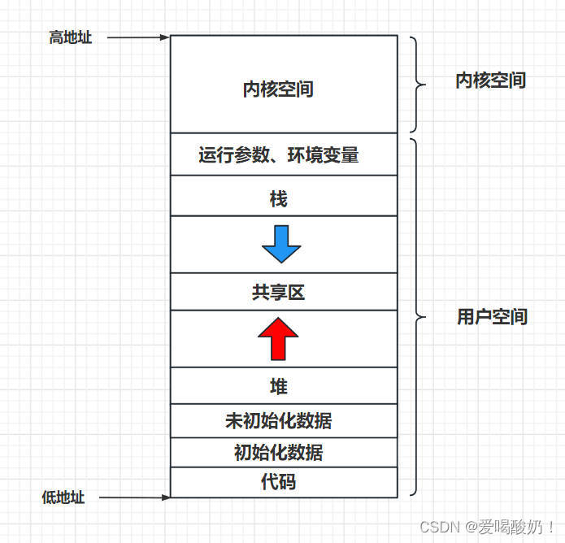
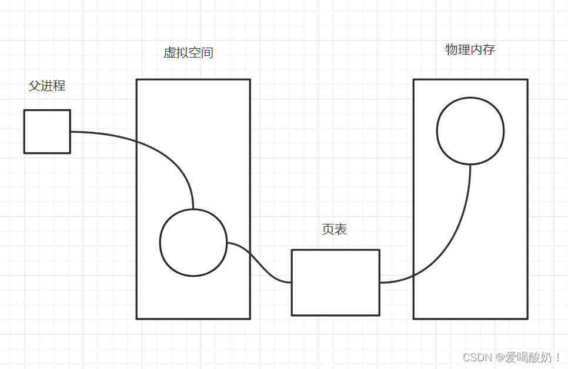
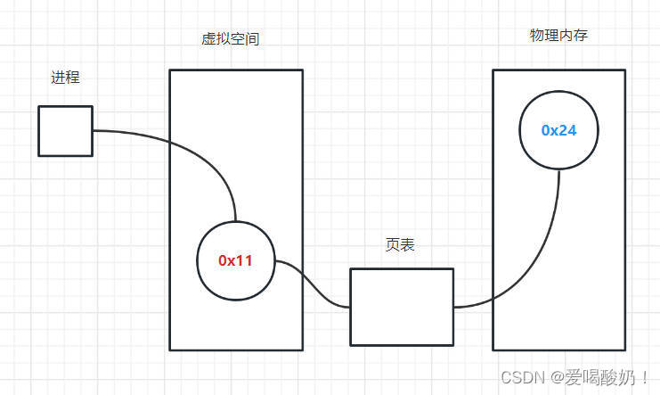
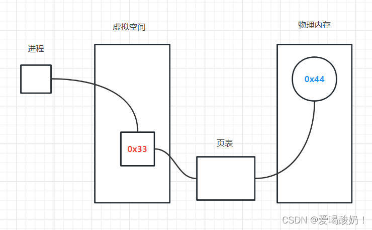
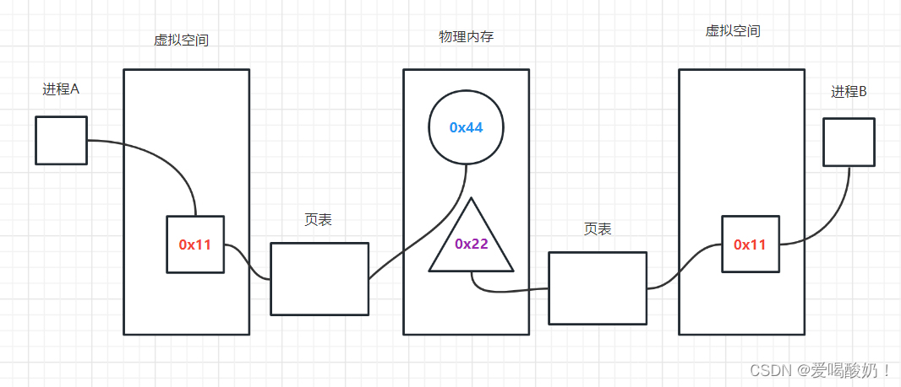

# Linux进程：程序地址空间与虚拟内存

## 一、程序地址空间

  程序是存储在硬盘上的一堆代码指令，如果要运行程序，CPU就会从硬盘中把程序指令拿出来，加载到我们的内存中。（所以当运行的程序太多的时候，内存空间就会不足）但是程序本身是不占用内存空间的，因为不使用程序的时候，代码都存储在硬盘中，要运行程序的时候，才会将程序加载到内存。

  相应的，为了更好的运行程序，内存空间被划分成了多个区域，每个区域都有其对应的作用，这里我们就需要简单的了解一下内存空间的布局。

  如图，这就是内存空间（也可以叫地址空间）的布局。

  用32位系统来说，32位系统对应的内存大小是4G。内存空间被分成两部分：用户空间和内核空间。其中内核空间是不可以直接访问的，必须通过系统提供的系统调用接口去访问内核的功能。内存空间的高地址处是内核空间，低地址处才是用户空间。

  用户空间从低地址到高地址处，依次被划分成这几部分：代码区、初始化数据区、未初始化数据区、堆区、共享区、栈区、运行参数和环境变量。

  来简单看一下这些部分的作用。

- 代码区：存储程序代码。
- 初始化数据区：存储已经初始化的数据。
- 未初始化数据区：存储未初始化的数据。
- 堆区：我们在C语言中常使用的malloc函数，就是从堆区申请的空间。
- 共享区：空间可以供多个进程一起访问。
- 栈区：运行函数时，需要对函数进行压栈，函数退出后，需要将函数出栈。
    
  蓝色箭头就是栈的增长方向，**栈从高地址向低地址增长**。红色箭头是堆的增长方向，**堆从低地址向高地址增长**。

## 二、虚拟地址空间

  简单了解了程序地址空间后，接下来就可以认识虚拟地址空间了，**虚拟地址空间也叫虚拟内存**。

  Linux中：pcb是task_struck结构体，虚拟内存是mm_struct结构体。

  进程就是运行中的程序，进程需要通过访问内存空间来得到它想要的数据，可是每个进程访问的内存空间其实是假的，或者说是虚拟的。

  比如：进程A中有一个变量 int a，这个程序的作用是，打印出a变量的地址，打印出的结果是0x11。如果是刚开始学习的话，我会毫不犹豫地认为这就是这个变量在内存中的地址，但其实并不是。这其实是一个虚假的地址，并不一定是该变量在内存空间中的真实地址。

  也就是说，进程每次访问的空间，其实都访问的是虚假的地址空间，或者叫虚拟内存更合适。示意图如下：

### 1. 虚拟内存的原理

  进程在运行时，需要访问物理内存中的数据，但进程和物理内存并没有直接进行数据交互，而是通过虚拟内存和页表进行交互。

  虚拟内存是对物理内存的映射，物理内存中的地址会映射到虚拟内存中，但是物理内存映射到虚拟内存后，并不一定还是原来的位置。如图，物理空间地址为0x24的空间，映射到虚拟内存后，映射到地址为0x11的空间中。

  而页表的作用就是，保存物理内存和虚拟内存的映射关系，比如物理内存中地址为0x24的空间映射到虚拟内存中是地址为0x11的空间，那么页表就会保存这个映射关系。保存了这个映射关系后，当进程访问地址为0x11的空间的数据时，系统就可以通过页表的映射关系去物理内存中找到对应的数据。

  系统中每个进程都会有一个对应的虚拟内存，进程直接访问的都是虚拟内存的空间。

### 2. 使用虚拟内存的原因？

  如果不使用虚拟内存，进程直接与物理内存进行交互。那么一个进程就可能访问了其他进程的空间，就有可能去修改其他进程的数据，这样就会造成程序运行混乱。

  比如：如果进程直接和物理内存交互，进程A申请并使用了地址为0x11的空间，进程B此时也访问了0x11的空间，并修改了其中的数据，那么进程A下次访问这块空间的时候，访问到的数据就不是之前的了。

### 3.如何实现虚拟空间？

  虚拟空间其实就是一个描述。假如电脑的物理内存是4G，那么操作系统会欺骗进程，系统会告诉每个进程：这4个G的天下都是你的，你想怎么用就怎么用，爱用哪个地址就用哪个地址。注意：是每个进程都有自己的虚拟空间。

  系统给每个进程都描述了一个虚拟的美景：看到你面前的江山了吗，这4个G都是你的。在Linux中，这个描述就是mm_struct结构体。做戏要做全套，欺骗也是如此。为了让自己的谎言更逼真，这个描述是十分细致的。上文中简单介绍了物理内存的划分，在虚拟内存的描述中，系统也详细的描述了一下虚拟内存的划分。比如：栈在虚拟内存的哪里？堆在虚拟内存的哪里？

  如果进程此时要申请地址为0x33，大小是4字节的空间，那么虚拟内存中这块空间就会分配给进程。但实际上是在物理内存中申请了一块大小符合的空间，然后这块空间的地址就与虚拟内存的0x33这块空间建立了映射关系，这个关系被存储在页表中。如果进程要访问地址为0x33空间中的数据，系统就会查找页表，在页表中查找这个虚拟地址对应的真实的物理内存的空间是什么，进而进行数据的访问。

  系统欺骗进程，告诉每个进程它们都拥有全部的4G空间，但实际上是所有进程共用这4G空间。那么就可能会有多个进程同时申请地址为0x11的空间，因为进程觉得自己拥有全部的空间，那么自己想申请哪个就申请哪个。但此时不用慌，因为进程申请的是虚拟空间的0x11，可是映射到物理内存上就是不同的空间，因此，进程有很大的自由度。解决了上文中直接使用物理内存而存在的问题。

### 4. 使用虚拟内存的好处

 （1）更好的利用了物理内存的碎片空间，进程申请了虚拟内存空间后，系统会在物理内存中找到合适的空间交给它，这样可以避免对大块空间的浪费。提高了物理内存的利用率。

 （2）可以离散的存储数据。

 （3）每个进程都有独自的虚拟内存，这样就不担心和其他的进程地址发生冲突。

